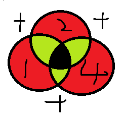
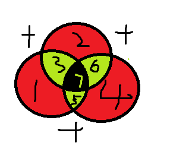
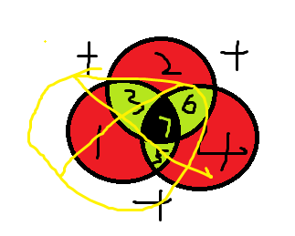

# 计算机组成与体系结构

::: tip 计算机系统结构的发展

1964 年，阿姆达尔(G.M.Amdahl)在介绍IBM360系统时指出:**计算机体系结构是站在程序员的角度所看到的计算机属性，即程序员要能编写出可在机器上正确运行的程序所必须了解的概念性结构和功能特性。**

1982 年，梅尔斯 (G.J.Myers)在其所著的《计算机体系结构的进展》(AdvancesinComputer Architecture)一书中定义了组成计算机系统的若干层次，每一层都提供一定的功 能支持它上面 的一层，并把不同层之间的界面定义为某种类型的体系结构。Myers 的定义发展了Amdahl 的概念性结构思想，明确了**传统体系结构就是指硬件与软件之间的界面，即指令集体系结构。**

 1984年，拜尔(J.L.Baer)在一篇题为“计算机体系结构(ComputerArchitecture)” 的文章中给 出了一 个含义更加广泛的定 义:体系结构由结构、组织、实现、 性能 4 个基本方面组成。 其中，结构指计算机系统各种硬件的互连，组织指各种部件的动态联系与管理，实现指各模块 设计的组装完成，性能指计算机系统的行为表现。这个定义发展了Amdahl 的功能特性思想。显然 ， 这里的计算机系统组织又成为体系结构的一个子集。
 
 计算机体系结构、计算机组织和计算机实现三者的关系如下。
 
1. 计算机体系结构 (ComputerArchitecture）是指计算机的**概念性结构和功能属性**。 
2. 计算机组织（ComputerOrganization）是指计算机体系结构的**逻辑实现**，包括机器内的数据流和控制流的组成以及逻辑设计等（常称为计算机组成原理）。 
3. 计算机实现（ComputerImplementation）是指计算机组织的**物理实现**（如微机原理）。

:::

课程内容提要

- 数据的表示
- 计算机结构
- Flynn分类法-对计算机类型分类
- CISC与RISC-计算机指令集
- 流水线技术
- 存储系统
- 总线系统
- 可靠性
- 校验码

## 数据的表示

### 进制的转换

略【微机原理】

### 原码反码补码移码

略【微机原理】

### 浮点数运算

**浮点数表示**
$$N=M*R^e$$
- M尾数
- e是指数
- R是基数

例如 $119 = 1.19 * 10^2$
- 1.19是尾数
- 2是指数
- 10是基数

**浮点数加减**

1. 对阶：将阶数大的阶数提出到尾数，使两数阶数相同
2. 尾数计算
3. 结果格式化

对阶


10^3 提一个10 到1.0，阶数基数相同，直接计算尾数

尾数计算: 10.0 + 1.19 =11.19

结果格式化

## CPU结构


## Flynn 分类法

指令流 | 数据流

| 体系结构类型            | 结构                            | 关键特性                | 代表                        |
| ----------------- | ----------------------------- | ------------------- | ------------------------- |
| 单指令流 \| 单数据流 SISD | 控制部分：1个<br>处理器：1个<br>主存模块：1个  |                     | 单处理器系统                    |
| 单指令流 \| 多数据流 SIMD | 控制部分：1个<br>处理器：多个个<br>主存模块：多个 | 各处理器以异步的形式执行同一条指令   | 并行处理机<br>阵列处理机<br>超级向量处理机 |
| 多指令流 \| 单数据流 MISD | 控制部分：多个<br>处理器：1个<br>主存模块：多个  | 被证明是不可能，至少是不实际的     | 目前没有，有文献称流水线计算机为此类        |
| 多指令流 \| 多数据流 MIMD | 控制部分：多个<br>处理器：多个<br>主存模块：多个  | 能够实现作业、任务、指令等各级全面并行 | 多处理机系统<br>多计算机            |

## CISC 与 RISC


| 指令系统类型   | 指令                                               | 寻址方式  | 实现方式                       | 其他            |
| -------- | ------------------------------------------------ | ----- | -------------------------- | ------------- |
| CISC(复杂) | 数量多，使用频率差别大，<br>可变长格式                            | 支持多种  | 微程序控制技术                    | 研制周期长         |
| RISC(精简) | 数量少，使用频率接近，定长格式，大部分为单周期指令，操作寄存器，只有Load/Store操作内存 | 支持方式少 | 增加了通用寄存器；硬布线逻辑控制为主；适合采用流水线 | 优化编译，有效支持高级语言 |


## 流水线

流水线是指在程序执行时多条指令重叠进行操作的一种准并行处理实现技术。各种部件同时处理是针对不同指令而言的，它们可同时为多条指令的不同部分进行工作，以提高各部件的利用率和指令的平均执行速度


### 流水线周期及流水线执行时间

流水线周期为执行时间最长的一段

流水线计算公式为：`1条指令的执行时间 +（指令条数-1）* 流水线周期 ` 

- 理论公式：$(t_1+t_2+...+t_k)+(n-1)*\Delta t$
- 实践公式：$(k+n-1) * \Delta t$
	- k：一条指令包括几个流水线周期。将第一条指令的各阶段周期看做流水线周期


例：若指令流水线把一条指令分为取指、分析和执行三部分，且三部分的时间分别是取指2ns，分析2ns，执行1ns。那么，流水线周期是多少？
100条指令全部执行完毕需要的时间是多少？

```
理论（2+2+1）+ (100-1)*2 = 203 ns
实践 (3+100-1)*2 = 204ns
```

### 流水线的吞吐率

流水线的吞吐率（Though Put rate, TP）是指在单位时间内流水线所完成的任务数量或输出的结果数量。

计算流水线吞吐率的最基本的公式如下

$$TP=\frac{指令条数}{流水线执行时间}$$

流水线最大吞吐率：

$$\lim_{x \to \infty} \frac{n}{(k+n-1)\Delta t} = \frac{1}{\Delta t}$$


### 流水线的加速比

完成同样一批任务，不使用流水线所用的时间与使用流水线所用的时间之比称为流水线的加速比。

计算流水线加速比的基本公式如下：

$$S=\frac{不使用流水线执行时间}{使用流水线执行时间}$$

### 流水线的效率

流水线的效率是指流水线的设备利用率。在时空图上，流水线的效率定义为n个任务
占用的时空区与k个流水段总的时空区之比。


计算流水线效率的公式为：

$$E=\frac{n个任务占用的时空区}{k个流水段的总的时空区}=\frac{T_0}{kT_k}$$


## 计算机层次化存储结构


### Cache

概念

- Cache的功能：提高CPU数据输入输出的速率，突破冯•诺依曼瓶颈，即CPU与存储系统间数据传送带宽限制。
- 在计算机的存储系统体系中，Cache是访问速度最快的层次。
- 使用Cache改善系统性能的依据是程序的局部性原理。

::: tip 使用“Cache+主存储器”的系统的平均周期
如果以 $h$ 代表对Cache的访问命中率，$t_1$ 表示Cache的周期时间，$t_2$ 表示主存储器周期
时间，以读操作为例，使用“Cache+主存储器”的系统的平均周期为 $t_3$，则：

$$t_3=h\times t_1+(1-h) \times t_2$$

其中，`(1-h)` 又称为失效率（未命中率）
:::

### 局部性原理

- 空间局部性：访问的内存位置在物理上邻近，一次访问后，其**附近的内存位置**很快也会被访问。
- 时间局部性：被访问过的内存位置或指令在**不久的将来**很可能再次被访问。
- 工作集理论：工作集是进程运行时被频繁访问的页面集合

例：

```cpp
    int i,j,s=0;
    for(i=1;i<1000;i++)
        for(j=1;j<1000;j++)
            s+=j;
    cout << s;
```


### 主存

分类


**1．随机存取存储器**

随机存取存储器，就是可以读出和写入的半导体存储器，简称RAM。CPU根据RAM的地址作随机地读取或写入操作，而存取操作所需的时间与信息存储位置是无关的。由于RAM的这个特点，在内存中RAM作为主体部分。根据RAM器件结构又可分为静态RAM和动态RAM两种。

1）静态RAM（Static RAM）
静态RAM存储器简称SRAM。这种存储器件的特点是存取速度很快，在不掉电的情况下，SRAM中的数据不会自动消失。SRAM采用多管的MOS器件构成，器件与微处理器的连接比较方便，但集成度较低且功耗较大。常见的SRAM有2114、6116、6264等。这类器件常在存储容量较少的系统中使用，如高速缓冲存储器（Cache）。

2）动态RAM（Dynamic RAM）
动态RAM存储器简称DRAM。这种存储器件在使用时，要求定期地进行刷新操作（Refresh）；否则，DRAM中的信息在2～8 ms后便自动消失。故需要增设额外的刷新电路，即重写电路。DRAM采用单管MOS构成，集成度高，功耗也很小。SRAM速度是DRAM的2～5倍，但SRAM价格比较贵。因此，微机的内存都用DRAM作为主要部件。常见的DRAM有2116、2118、6164、MN4164等。
另外，还有准静态RAM（Pseudo Static RAM），简称PSRAM。这是一种介于SRAM和DRAM之间的存储器件。

**2．只读存储器**

只读存储器简称ROM。特点是在系统运行时只能读取，不能写入，关闭电源后ROM中的信息不会丢失。因此，ROM被用于存放系统程序（如BIOS）和固化应用程序。这类存储器根据电路结构可分为以下几种。

（1）PROM：可编程ROM（Programmable ROM）。
将程序写入PROM后，就不可以再修改。

（2）EPROM：可擦除、可编程ROM（Erasable PROM）。
设计的程序写入后，可用紫外光照射擦除ROM中的内容，重新写入新的程序。

（3）E2 PROM：电可擦除、可编程ROM（Electrically Erasable PROM）。
被固化在该芯片中的程序，可以利用电压来擦除，重新写入新的程序。

性能


### 磁盘结构和参数


$$存取时间=寻道时间+等待时间(平均定位时间+转动延迟)$$

- 寻道时间是指磁头移动到磁道所需的时间；
- 等待时间为等待读写的扇区转到磁头下方所用的时间；

试题


**1. 未优化**

R0-R9

- R0 读取 3ms
- R0 处理+转动到下一区 33ms
- 共 `（33+3）*10=360 ms`

R10

- 读取 3ms
- 处理 3ms

共 360+6 =366 ms

**2. 优化后**

R0-R9

- R0 读取 3ms
- R0 处理+转动到下一区 3ms
- 共 `（3+3）*10=60 ms`

R10

- 读取 3ms
- 处理 3ms

共 60+6 =66 ms

## 总线

根据所处位置

- 内部总线
- 系统总线：DB、AB、CB
- 外部总线

## 系统可靠性分析

### 串联系统与并联系统

**串联模型**


可靠性
$$R=R_1 \times R_2 \times ... \times R_n$$

失效率（近似公式）
$$\lambda = {\lambda}_1 +{\lambda}_2+...+{\lambda}_n $$

**并联模型**


可靠性
$$R=1-(1-R_1) \times (1-R_2) \times ... \times (1-R_n)$$

失效率
$$\mu = \frac{1}{\frac{1}{\lambda}\sum_{j=1}^{n} \frac{1}{j} } $$
$$\mu =1-R$$


### 模冗余系统与混合系统

模冗余系统(基本不考)


$$R= \sum_{i=n+1}^{m} C_m^j \times R_0^i(1-R_0)^{m-i}$$

混合系统


$$R\times(1-(1-R)^3)\times(1-(1-R)^2)$$


## 差错控制-校验码


::: tip 什么是检错和纠错？
检错只检测出错误即可
纠错不但检测出错误还需要将其纠正
:::

::: tip 什么是码距？
一个编码系统的码距是整个编码系统中任意（所有）两个码字的最小距离。

例：

若用1位长度的二进制编码。若A=1，B=0。这样A、B之间的最小码距为1。

若用2位长度的二进制编码，若以A=11，B=00为例，A、B之间的最小码距为2。

若用3位长度的二进制编码，可选用111，000作为合法编码。A、B之间的最小码距为3。
:::

::: tip 码距与检错、纠错有何关系？
1. 在一个码组内为了检测e个误码，要求最小码距d应该满足：d>=e+1
2. 在一个码组内为了纠正t个误码，要求最小码距d应该满足：d>=2t+1
:::

### 奇偶校验码

奇偶校验(Parity Codes)

是一种简单而有效的校验方法。这种方法通过在编码中增加一位校验位来使编码中1的个数为奇数（奇校验）或者为偶数（偶校验），从而使码距变为2。对于奇校验，它可以检测代码中奇数位出错的编码，但不能发现偶数位出错的情况，即当合法编码中的奇数位发生了错误时，即编码中的1变成0或0变成1，则该编码中1的个数的奇偶性就发生了变化，从而可以发现错误。

常用的奇偶校验码有3种：水平奇偶校验码、垂直奇偶校验码和水平垂直校验码。

二维奇偶校验

可以检测一位错误


### 模2除法

 引用自 https://wenku.baidu.com/view/460ee236c181e53a580216fc700abb68a982adda.html?fr=aladdin664466&ind=1&aigcsid=0&qtype=0&lcid=1&queryKey=%E6%A8%A12%E9%99%A4%E6%B3%95&_wkts_=1719921939143&bdQuery=%E6%A8%A12%E9%99%A4%E6%B3%95
 
十进制的除法，大家都会做：列个竖式，商，写在上面，上个几，再用
被除数减去积，求得余数…。

二进制的除法，和十进制的计算方法相同，也要列出个竖式计算。

二进制的除法，还有一种“模2除”，很多人就不熟悉了，甚至连“百度百科”中，也写不清楚这个概念和方法。此外还有：“模2和”、“模2减”等等。

二进制数字的计算，很有特点。

两个二进制数字的相加，如果不考虑进位，就是“模2和”；

两个二进制数字的相减，如果不考虑借位，就是“樟2减”

“模2和”、“模2减”，名称、算法虽然不一样，但是，结果是相同的，实际上都是两个二进制数字相“异或”。

如果两个二进制数字相同，“异或”的结果就是0；

如果两个二进制数字不同，“异或”的结果就是1。

“模2除”就是在求余数的时候，应用了“模2减”。

下图就是“二进制的除法”和“模2除”的计算过程竖式：


在“模2除”中，因为使用了“模2减”，所以在商上1的时候，不要考虑够不够减（因为这里不是二进制的除法），**只要最高位是1，位数凑够了四位，就可以用它“模2减”1001。**

“模2除”在“循环冗余校验（CRC）”中，有广泛的应用。

> 总结：不考虑进借位，最高位是1，商的某位乘出来的数 和除数的位数对齐，就可以异或

### 循环校验码（CRC）

例：原始报文为“11001010101”，其生成多项式为：“ $x^4+x^3+x+1$ ”，对其进行CRC编码后的结果为？

多项式 x的多少次方指示了相应权重的二进制位是0还是1

生成多项式作为除数，原始后面补0（生成多项式长度-1 个0）作为被除数。


将余数替换掉原始报文所补的0，得到结果

### 海明校验码


校验码的范围 应当可以区分出 数据正确（编码全0）和 第几位出错


数据位与校验位之间位数的关系


---
引自
> https://www.cnblogs.com/godoforange/p/12003676.html

## 海明码学习前提
  
记住几个要点：  
  
1. 不要用异或套用公式！！！！题目随便变几个变死你！  
2. 看完这篇博客不要看别的博客！！！！别的人瞎写的坑死你  
  
学习海明码之前，我们要约定 3 个原则：  
  
1. 海明码只能检测出 2 位错，纠 1 位错 (因此不要问如果 3 位错怎么办等幼稚问题)。  
2. 海明码默认进行偶校验 (除非特殊说明使用奇校验)。  
3. 海明码是一串由 0 和 1 组成的序列 (除 01 外没有其他的值，记住了！这是重点)  
  
如果下面有任何无法理解的问题，反复看上面三个原则，下面再也不赘述。
## 前提：奇偶校验

奇校验：这串序列 1 的个数如果为偶数则在前面加个 1，使 1 的个数变成奇数，否则加 0。
偶校验：这串序列 1 的个数如果为奇数则在前面加个 1，使 1 的个数变成偶数，否则加 0。

例子：`1111` 奇校验就是 `11111` 偶校验就是 `01111`
`1110` 奇校验就是 `01110` 偶校验就是 `11110`

特性是检测一位错，无法纠错。

## 概述：海明码的构成


例如如下序列：
`1100`
我们想要让其变成海明码只需如下操作

### 1. 算出校验位数 k

正常情况下我们需要如下此操作：

2^k >= k + 数据位数 + 1

这里等于 3

### 2. 确定校验位在海明码中的位置

这里按 2^k 次幂留出来，就像 1，2，4，8，16，32。（如果问有 5 位等其他烦人的数据位怎么办后面我会说，先按 4 位数做）

<table><thead><tr><th>H7</th><th>H6</th><th>H5</th><th>H4</th><th>H3</th><th>H2</th><th>H1</th></tr></thead><tbody><tr><td>1</td><td>1</td><td>0</td><td></td><td>0</td><td></td><td></td></tr></tbody></table>

### 3. 分组（重点，很多人蒙圈就在此）

我们需要确认 H1,H2,H4 这三个校验位都来校验哪些位置。
我们按这个规则进行分配。

#### 将 1,2,4（海明码下标为 1,2,4）

的二进制码写出来，并且最高位补到 3 位 (前面算的 K 数)
如下所示：

<table><thead><tr><th>1</th><th>2</th><th>4</th></tr></thead><tbody><tr><td>001</td><td>010</td><td>100</td></tr></tbody></table>

#### 然后我们将 0 替换为 `*`，作为通配表。

<table><thead><tr><th>1</th><th>2</th><th>4</th></tr></thead><tbody><tr><td>**1</td><td>*1*</td><td>1**</td></tr></tbody></table>

#### 我们将 1 到 7 的二进制序列，列出来如下表

<table><thead><tr><th>7</th><th>6</th><th>5</th><th>4</th><th>3</th><th>2</th><th>1</th></tr></thead><tbody><tr><td>111</td><td>110</td><td>101</td><td>100</td><td>011</td><td>010</td><td>001</td></tr></tbody></table>

#### ！！！重点！！！！

我们将 7->1 依次与上面的通配表进行匹配

<table><thead><tr><th>1</th><th>2</th><th>4</th></tr></thead><tbody><tr><td>**1</td><td>*1*</td><td>1**</td></tr><tr><td>001（1）</td><td>010（2）</td><td>100（4）</td></tr><tr><td>011（3）</td><td>011（3）</td><td>101（5）</td></tr><tr><td>101（5）</td><td>110（6）</td><td>110（6）</td></tr><tr><td>111（7）</td><td>111（7）</td><td>111（7）</td></tr></tbody></table>

因此我们可以确定
H1 负责 1 3 5 7 位数的校验
H2 负责 2 3 6 7 位数的校验
H4 负责 4 5 6 7 位数的校验

### 4. 求出校验位是 0 还是 1

因为上面我们得出以下结论：

H1 负责 1 3 5 7 位数的校验
H2 负责 2 3 6 7 位数的校验
H4 负责 4 5 6 7 位数的校验

那 根据

<table><thead><tr><th>H7</th><th>H6</th><th>H5</th><th>H4</th><th>H3</th><th>H2</th><th>H1</th></tr></thead><tbody><tr><td>1</td><td>1</td><td>0</td><td></td><td>0</td><td></td><td></td></tr><tr><td>这张表，我们根据偶校验很容易就求出以下结论：</td><td></td><td></td><td></td><td></td><td></td><td></td></tr><tr><td>H3,H5,H7 1 的个数为奇数 因此 H1=1</td><td></td><td></td><td></td><td></td><td></td><td></td></tr><tr><td>H3,H6,H7 1 的个数为偶数 因此 H2=0</td><td></td><td></td><td></td><td></td><td></td><td></td></tr><tr><td>H5,H6,H7 1 的个数为偶数 因此 H4=0</td><td></td><td></td><td></td><td></td><td></td><td></td></tr><tr><td>至此我们得出了完整的汉明码</td><td></td><td></td><td></td><td></td><td></td><td></td></tr></tbody></table>

<table><thead><tr><th>H7</th><th>H6</th><th>H5</th><th>H4</th><th>H3</th><th>H2</th><th>H1</th></tr></thead><tbody><tr><td>1</td><td>1</td><td>0</td><td>0</td><td>0</td><td>0</td><td>1</td></tr></tbody></table>

### 5. 查错

查错比较简单，如果以下三组
既
H1,H3,H5,H7
或者
H2,H3,H6,H7
或者
H4,H5,H6,H7
偶校验出错，则出错。

比方说 如果 H1,H3,H5,H7 由 1100 变成了 1110 （1 的个数为偶数）就是出错了

这里该不赘述

### 6. 纠错

首先我们先理解以下为什么海明码能纠错。
首先我们先画个圆。然后按如下形式做交叉


在每个相邻部位，我们做相加处理

变成了如下形式


当我们如果发现偶校验出错，
比方说在 1 3 7 5 这个区域出错。

如果这个位置出错了，那么一定是 1 3 7 5 这四个位置中的一个位置出错 (如果俩位出错则无法纠错，这个点一定要记住)
如果此时其他的俩个组 即：2，3，6，7 和 4，5，6，7 偶校验都通过了的话。
也就证明只可能是 1 出错
所以我们可以将 1 的位数 做修改。如果是 0 变为 1，如果是 1 变为。来达到纠错的目的。

但是如果 2，3，5，7 这个位置也出错了，4，5，6，7 这个位置没有出错。
我们很容易就推导出，是 3 这个位置出错了。

我们就可以修改 3 的值，如果是 0 变为 1 或者如果是 1 变为 0.

在此时我们会发现一个巧妙的规则！
当我们把 1，3，5，7 设为 P1,
2,3,6,7 设为 P2
4,5,6,7 设为 P3 时

当如果哪组校验失败就为 1

<table><thead><tr><th>P3</th><th>P2</th><th>P1</th><th>出错 (第几) 位数</th></tr></thead><tbody><tr><td>0</td><td>0</td><td>1</td><td>1</td></tr><tr><td>0</td><td>1</td><td>0</td><td>2</td></tr><tr><td>0</td><td>1</td><td>1</td><td>3</td></tr><tr><td>1</td><td>0</td><td>0</td><td>4</td></tr><tr><td>1</td><td>0</td><td>1</td><td>5</td></tr><tr><td>1</td><td>1</td><td>0</td><td>6</td></tr><tr><td>1</td><td>1</td><td>1</td><td>7</td></tr></tbody></table>

刚好是对应的二进制编码。就是这么绝。

其实学完海明码之后，我真的觉得人家实在是太聪明了。

### 5 位数数据

至此，其实如果认真看上面的部分，大家已经可以理解海明码是如何实现的了。
但是我还是再带大家写一次。这种 5 位数的。关键在于如何分组！！！！！

比方说
`10001`

#### 先求出校验位数：

2 ^ k > = k + 5 + 1
则 k = 4

#### 画出表格

将 1，2，4，8 位置空出来，再将数据位填进去

<table><thead><tr><th>H9</th><th>H8</th><th>H7</th><th>H6</th><th>H5</th><th>H4</th><th>H3</th><th>H2</th><th>H1</th></tr></thead><tbody><tr><td>1</td><td></td><td>0</td><td>0</td><td>0</td><td></td><td>1</td><td></td><td></td></tr></tbody></table>

#### 分组 (* 为通配符)

<table><thead><tr><th>8</th><th>4</th><th>2</th><th>1</th></tr></thead><tbody><tr><td>1***</td><td>*1**</td><td>**1*</td><td>***1</td></tr><tr><td>8,9</td><td>4,5,6,7</td><td>2,3,6,7</td><td>1,3,5,7,9</td></tr></tbody></table>

#### 偶校验每个分组得出结果

<table><thead><tr><th>H9</th><th>H8</th><th>H7</th><th>H6</th><th>H5</th><th>H4</th><th>H3</th><th>H2</th><th>H1</th></tr></thead><tbody><tr><td>1</td><td>1</td><td>0</td><td>0</td><td>0</td><td>0</td><td>1</td><td>1</td><td>0</td></tr></tbody></table>

### 总结

如果还有人不懂，请仔仔细细跟着我走一遍。本人保证此思路是绝对正确的。

给我讲懂的老师是哈工大刘宏伟（MOOC 课上有）

所教的是计算机组成原理

谢谢您老师。

---
