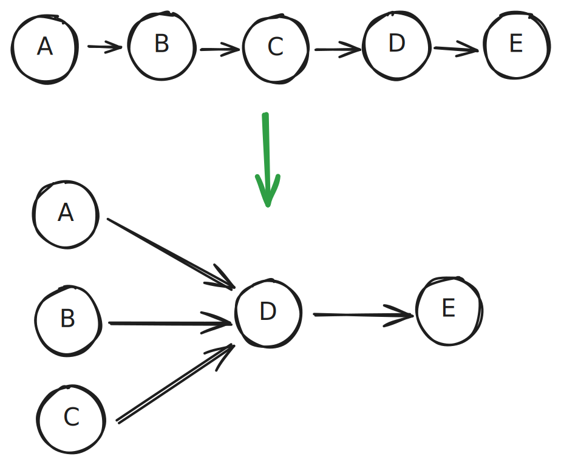
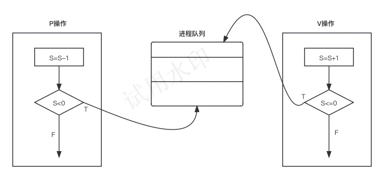

# 操作系统

## 操作系统概述

内容提要

- 进程管理
	1. 进程的状态
	2. 前趋图
	3. PV操作
	4. 死锁问题
- 存储管理
	1. 段页式存储
	2. 页面置换算法
- 文件管理
	1. 索引文件
	2. 位示图
- 作业管理
- 设备管理
- 微内核操作系统
	  1. 虚设备与SPOOLING技术

## 进程管理

### 进程状态

### 前驱图

A. 绞肉
B. 切葱末
C. 切姜末
D. 搅拌
E. 包饺子

ABC 无先后关系，可以并行
D与E与ABC之间存在先后关系，这是前趋图要表示的关系

### 进程的同步与互斥

同步：同时完成任务。速度匹配，快的等待

生产者与消费者

单缓冲区
1. 消费与生产的互斥，消费完才能生产
2. 消费和生产的同步，生产完紧随着消费

### PV操作（重点）

- 临界资源：诸进程间需要互斥方式对其进行共享的资源，如打印机、磁带机等
- 临界区：每个进程中访问临界资源的那段代码称为临界区
- 信号量：一种特殊的变量

