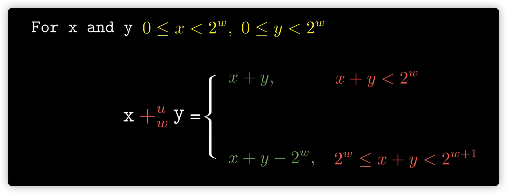
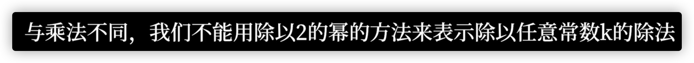

# 整数运算的数学推导

::: INFO 参考资料
参考视频：[深入理解计算机系统](https://www.bilibili.com/video/BV1Ff4y1q7Kf/?share_source=copy_web&vd_source=57dbd16b8c7c2ad258cccce5966c5be8)
书：《CSAPP》
:::

## 整数的表示

### 无符号数

定义

表示范围

### 有符号数（补码）

定义

### 无符号数与有符号数的转化

### 有符号数（补码）的位扩展

### 截断无符号数

2进制数的截断操作，可以对应取模操作

### 截断有符号数

同样是先当做无符号数直接截断，然后翻译成有符号数

## 整数的加法运算

### 无符号加法

c语言中检测溢出

证明了溢出结果小于任意一个数。不溢出时是大于或等于任意一个数

### 有符号加法

## 整数的减法运算

在模系统中，减一个数等于加其逆元，逆元即相当于相反数

### 逆元的定义

### 无符号数的逆元

无符号，相加为2^w 时，溢出变0，其互为逆元

故对于一个无符号数，其加法逆元为

### 有符号数的逆元

 TMin的逆元是它本身 ，其他有符号数的逆元是它的相反数

## 整数的乘法

### 无符号数乘法

### 有符号数（补码）乘法

截断后的结果与无符号等效

虽然无符号数和补码两种乘法乘积的完整位表示不同，但是截断之后结果的位级表示却相同

通俗解释：将二进制翻译成无符号和有符号值，乘。得到两种结果，再转成二进制截断后的值相同。

> 编译器一般使用移位、加法代替整数乘法操作
### 无符号数乘法的机器实现

当做有符号数时也可以，补码**加减**结果与无符号相同，**乘法**的截断结果也相同。即转为加减与移位时，无符号与有符号的结果等效
#### 左移

#### 无符号乘法转为移位和加法

计算机内部一般将乘法转为移位和加法

## 整数的除法

除法向0舍入

### 无符号数除法 逻辑右移

设

将x1左移k位

得

令`x=x1*2^k+x2`

知

### 有符号数（补码）除法 算数右移 - 无证明

符号位为0的与无符号相同

符号位为1的负数移位如图所示

会有不合适的舍入

需要加入偏置，来修正

无法推广到除以任意常数

