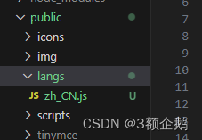
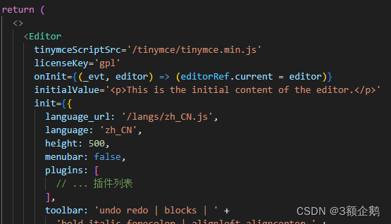
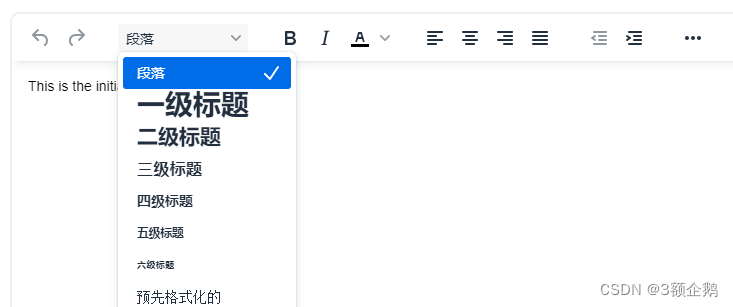

# React 使用TinyMCE v7（免费版）

官方使用文档：[Installing TinyMCE | TinyMCE Documentation](https://www.tiny.cloud/docs/tinymce/latest/installation/ "Installing TinyMCE | TinyMCE Documentation")

我参考的这个：使用 React 框架托管 TinyMCE 包[Hosting the TinyMCE package with the React framework | TinyMCE Documentation](https://www.tiny.cloud/docs/tinymce/latest/react-pm-host/ "Hosting the TinyMCE package with the React framework | TinyMCE Documentation")

###### 1、引入

```bash
npm install --save tinymce @tinymce/tinymce-react fs-extra
```
###### 2、设置`postinstall`脚本将 TinyMCE 复制到公共目录进行托管

_postinstall.js_

```javascript
import fse from 'fs-extra';
import path from 'path';
const topDir = import.meta.dirname;
fse.emptyDirSync(path.join(topDir, 'public', 'tinymce'));
fse.copySync(path.join(topDir, 'node_modules', 'tinymce'), path.join(topDir, 'public', 'tinymce'), { overwrite: true });
```


_package.json_

```javascript
{
  // ... other content omitted for brevity ...
  "scripts": {
    // ... other scripts omitted for brevity ...
    "postinstall": "node ./postinstall.js"
  }
}
```


_.gitignore_

```javascript
# ... other rules omitted for brevity ...
/public/tinymce/
```


###### 3、运行`postinstall`将 TinyMCE 复制到`public`目录

```javascript
npm run postinstall
```


###### 4、组件编辑器内容换为：

```jsx
//JS代码
import { useRef } from 'react';
import { Editor } from '@tinymce/tinymce-react';
import './App.css';

export default function App() {
  const editorRef = useRef(null);
  const log = () => {
    if (editorRef.current) {
      console.log(editorRef.current.getContent());
    }
  };
  return (
    <>
      <Editor
        tinymceScriptSrc='/tinymce/tinymce.min.js'
        // gpl：自托管，不使用tinymce 云
        licenseKey='gpl'
        onInit={(_evt, editor) => editorRef.current = editor}
        initialValue='<p>This is the initial content of the editor.</p>'
        init={{
          height: 500,
          menubar: false,
          plugins: [
            'advlist', 'autolink', 'lists', 'link', 'image', 'charmap',
            'anchor', 'searchreplace', 'visualblocks', 'code', 'fullscreen',
            'insertdatetime', 'media', 'table', 'preview', 'help', 'wordcount'
          ],
          toolbar: 'undo redo | blocks | ' +
            'bold italic forecolor | alignleft aligncenter ' +
            'alignright alignjustify | bullist numlist outdent indent | ' +
            'removeformat | help',
          content_style: 'body { font-family:Helvetica,Arial,sans-serif; font-size:14px }'
        }}
      />
      <button onClick={log}>Log editor content</button>
    </>
  );
}
```


```jsx
// ts
import React, { useRef } from 'react';  
import { Editor } from '@tinymce/tinymce-react';  

type EditorInstance = any;
  
export default function App() {  
  const editorRef = useRef<EditorInstance>(null);  
  
  const log = () => {  
    if (editorRef.current) {  
      console.log(editorRef.current.getContent());  
    }  
  };  
  
  return (  
    <>  
      <Editor  
        tinymceScriptSrc='/tinymce/tinymce.min.js'  
        
        licenseKey='gpl'  
        onInit={(_evt, editor) => (editorRef.current = editor)}  
        initialValue='<p>This is the initial content of the editor.</p>'  
        init={{  
          height: 500,  
          menubar: false,  
          plugins: [  
            // ... 插件列表  
          ],  
          toolbar: 'undo redo | blocks | ' +  
            'bold italic forecolor | alignleft aligncenter ' +  
            'alignright alignjustify | bullist numlist outdent indent | ' +  
            'removeformat | help',  
          content_style: 'body { font-family:Helvetica,Arial,sans-serif; font-size:14px }'  
        }}  
      />  
      <button onClick={log}>Log editor content</button>  
    </>  
  );  
}
```


###### 5、npm run dev

###### 6、可能的报错

> (node:5280) Warning: To load an ES module, set "type": "module" in the package.json or use the .mjs extension.  
> (Use `node --trace-warnings ...` to show where the warning was created)  
> C:\Users\Administrator\Desktop\react-ant-admin\postinstall.js:1  
> export {}  
> ^^^^^^
> 
> SyntaxError: Unexpected token 'export'  
>     at wrapSafe (node:internal/modules/cjs/loader:1288:20)  
>     at Module._compile (node:internal/modules/cjs/loader:1340:27)  
>     at Module._extensions..js (node:internal/modules/cjs/loader:1435:10)  
>     at Module.load (node:internal/modules/cjs/loader:1207:32)  
>     at Module._load (node:internal/modules/cjs/loader:1023:12)  
>     at Function.executeUserEntryPoint [as runMain] (node:internal/modules/run_main:135:12)  
>     at node:internal/main/run_main_module:28:49

postinstall.js改为 postinstall.mjs

package.json改为

```javascript
{
  // ... other content omitted for brevity ...
  "scripts": {
    // ... other scripts omitted for brevity ...
    "postinstall": "node ./postinstall.mjs"
  }
}
```


> C:\Users\Administrator\Desktop\react-ant-admin\node_modules\.pnpm\fs-extra@11.2.0\node_modules\fs-extra\lib\util\stat.js:81  
>       throw new Error(`Cannot overwrite directory '${dest}' with non-directory '${src}'.`)   
>             ^
> 
> Error: Cannot overwrite directory 'C:\Users\Administrator\Desktop\react-ant-admin\public\tinymce' with non-directory 'C:\Users\Administrator\Desktop\react-ant-admin\node_modules\tinymce'.  
>     at Object.checkPathsSync (C:\Users\Administrator\Desktop\react-ant-admin\node_modules\.pnpm\fs-extra@11.2.0\node_modules\fs-extra\lib\util\stat.js:81:13)  
>     at Object.copySync (C:\Users\Administrator\Desktop\react-ant-admin\node_modules\.pnpm\fs-extra@11.2.0\node_modules\fs-extra\lib\copy\copy-sync.js:27:38)  
>     at file:///C:/Users/Administrator/Desktop/react-ant-admin/postinstall.mjs:5:5  
>     at ModuleJob.run (node:internal/modules/esm/module_job:218:25)  
>     at async ModuleLoader.import (node:internal/modules/esm/loader:329:24)  
>     at async loadESM (node:internal/process/esm_loader:28:7)  
>     at async handleMainPromise (node:internal/modules/run_main:113:12)

pnpm下报错，node_modules删了yarn install正常了

fs-extra会对依赖内的文件进行复制，对于依赖的安装管理，npm 和 pnpm 的策略是不同的，这就会导致有一些依赖的文件复制失败，提示找不到文件的错误。

###### 7. 汉化

[下载汉化包： Language Packages | Trusted Rich Text Editor | TinyMCE](https://www.tiny.cloud/get-tiny/language-packages/ "下载汉化包： Language Packages | Trusted Rich Text Editor | TinyMCE")

将包放到public下

​

在init中设置

```javascript
        init={{
          language_url: '/langs/zh_CN.js',
          language: 'zh_CN',
```


​

完成

​编辑

参考

[在React中使用TinyMCE富文本编辑器_react tinymce-CSDN博客](https://blog.csdn.net/weixin_43470799/article/details/123387097 "在React中使用TinyMCE富文本编辑器_react tinymce-CSDN博客")
[TinyMCE中文文档中文手册](http://tinymce.ax-z.cn/ "TinyMCE中文文档中文手册")

​