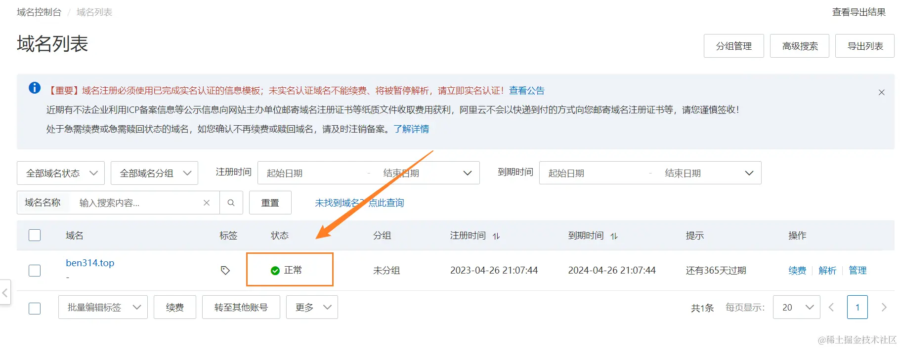
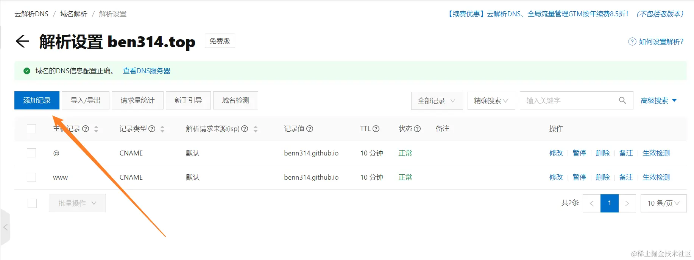
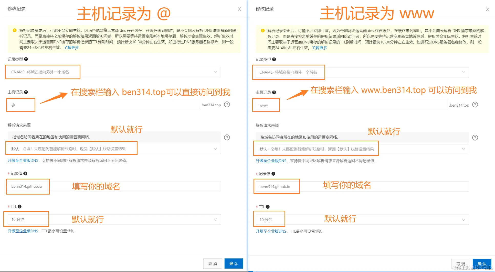
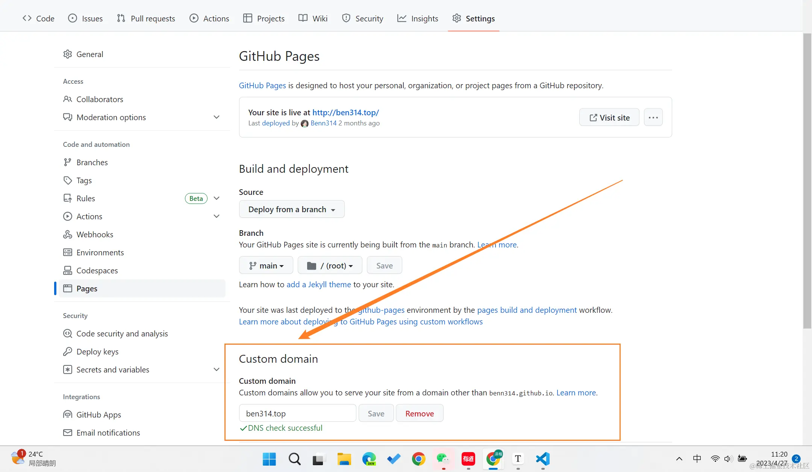
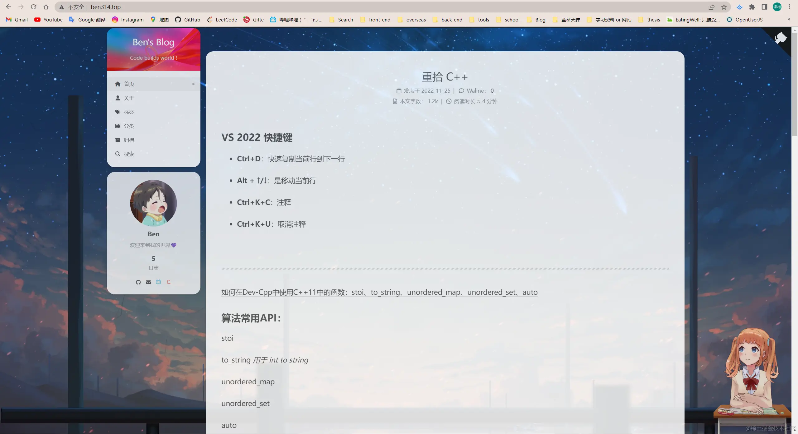

# Github Pages 绑定阿里云域名

> 下面讲一下如何在阿里云购买域名并绑定到你的 Github Pages

注册阿里云域名
=======

1.  进入 [阿里云官网](https://link.juejin.cn?target=https%3A%2F%2Fwww.aliyun.com%2F "https://www.aliyun.com/")
2.  注册阿里云域名[【域名注册点此进入】](https://link.juejin.cn?target=https%3A%2F%2Fwanwang.aliyun.com%2Fdomain%2F%3Fspm%3D5176.100251.111252.16.1f6c4f15LXISIz "https://wanwang.aliyun.com/domain/?spm=5176.100251.111252.16.1f6c4f15LXISIz")
3.  选购心仪域名后，如果是第一次购买需要进行实名认证，在订单详情页有提示进行认证 (平均为 4-5 小时的审核时间，审核通过后完成下单，下单的域名同时需要审核时间，审核通过后进入下一步）

域名解析
====

当域名状态显示为 `正常` 后，我们便可以开始进行 `域名解析`了，点击右侧操作中的 `解析` 进入 **云解析 DNS** 页面，它的好处是不用我们在本地项目配置解析文件（在本地配置解析文件的话要放入`source`目录中，如果放在根目录里，项目部署时解析文件会被删除）

在这里，我们点击 `添加记录` ，需要添加两条 `CNAME` 记录（什么是 CNAME？为什么要添加两条？下面待会会进行解释）

CNAME 记录
--------

**使用场景**

> 当需要将域名指向另一个域名，再由另一个域名提供 IP 地址，就需要添加 CNAME 记录，最常用到 CNAME 的场景包括做 CDN、企业邮箱、全局流量管理等。

**设置方法**

*   记录类型：选择 **CNAME 。**
*   主机记录：一般是指子域名的前缀（如需创建子域名为 www.dns-example.com 的解析, 主机记录输入 **“www”** ；如需实现 dns-example.com 的解析，主机记录输入 “@”）。
*   解析线路：默认为必填项，否则会导致部分用户无法解析。
*   记录值：记录值为 CNAME 指向的域名，只可以填写域名。
*   TTL：为缓存时间，数值越小，修改记录各地生效时间越快，默认为 10 分钟。

以我的域名进行举例

主机记录设置了 @/www，便可以通过 [ben314.top](https://link.juejin.cn?target=ben314.top "ben314.top") 以及 [www.ben314.top](https://link.juejin.cn?target=www.ben314.top "www.ben314.top") 两种形式对博客进行访问

当然，你也可以使用 `A记录` 进行解析，只需要知道自己 Github 服务器的主机号就行，打开命令行窗口对你的博客进行 ping 操作，例如 `ping benn314.github.io`

> 更多添加解析记录介绍请前往 [阿里云帮助中心 - 添加解析记录](https://link.juejin.cn?target=https%3A%2F%2Fhelp.aliyun.com%2Fdocument_detail%2F29725.html%3Fspm%3Da2c4g.121109.0.0.25986527OxYLL3%23h2-cname-2 "https://help.aliyun.com/document_detail/29725.html?spm=a2c4g.121109.0.0.25986527OxYLL3#h2-cname-2")

域名绑定
====

解析完毕后，我们便可以进行域名绑定了，前往你部署博客仓库的 Github Page，在 `Custom domain` 项中可以添加进行解析后的自定义域名

稍微片刻后，便可以通过你购买的域名访问博客了🌠

