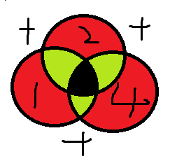
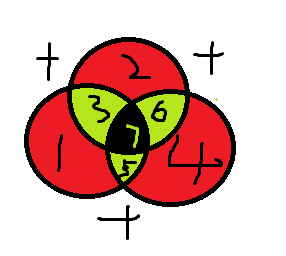
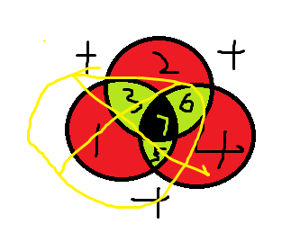

# 海明校验码

## 海明码学习前提

记住几个要点：

1. 不要用异或套用公式！！！！题目随便变几个变死你！
2. 看完这篇博客不要看别的博客！！！！别的人瞎写的坑死你

学习海明码之前，我们要约定 3 个原则：

1. 海明码只能检测出 2 位错，纠 1 位错 (因此不要问如果 3 位错怎么办等幼稚问题)。
2. 海明码默认进行偶校验 (除非特殊说明使用奇校验)。
3. 海明码是一串由 0 和 1 组成的序列 (除 01 外没有其他的值，记住了！这是重点)

如果下面有任何无法理解的问题，反复看上面三个原则，下面再也不赘述。

## 前提：奇偶校验

奇校验：这串序列 1 的个数如果为偶数则在前面加个 1，使 1 的个数变成奇数，否则加 0。
偶校验：这串序列 1 的个数如果为奇数则在前面加个 1，使 1 的个数变成偶数，否则加 0。

例子：`1111` 奇校验就是 `11111` 偶校验就是 `01111`
`1110` 奇校验就是 `01110` 偶校验就是 `11110`

特性是检测一位错，无法纠错。

## 概述：海明码的构成

例如如下序列：
`1100`
我们想要让其变成海明码只需如下操作

### 1. 算出校验位数 k

正常情况下我们需要如下此操作：

2^k >= k + 数据位数 + 1

这里等于 3

### 2. 确定校验位在海明码中的位置

这里按 2^k 次幂留出来，就像 1，2，4，8，16，32。（如果问有 5 位等其他烦人的数据位怎么办后面我会说，先按 4 位数做）

<table><thead><tr><th>H7</th><th>H6</th><th>H5</th><th>H4</th><th>H3</th><th>H2</th><th>H1</th></tr></thead><tbody><tr><td>1</td><td>1</td><td>0</td><td></td><td>0</td><td></td><td></td></tr></tbody></table>

### 3. 分组（重点，很多人蒙圈就在此）

我们需要确认 H1,H2,H4 这三个校验位都来校验哪些位置。
我们按这个规则进行分配。

#### 将 1,2,4（海明码下标为 1,2,4）

的二进制码写出来，并且最高位补到 3 位 (前面算的 K 数)
如下所示：

<table><thead><tr><th>1</th><th>2</th><th>4</th></tr></thead><tbody><tr><td>001</td><td>010</td><td>100</td></tr></tbody></table>

#### 然后我们将 0 替换为 `*`，作为通配表。

<table><thead><tr><th>1</th><th>2</th><th>4</th></tr></thead><tbody><tr><td>**1</td><td>*1*</td><td>1**</td></tr></tbody></table>

#### 我们将 1 到 7 的二进制序列，列出来如下表

<table><thead><tr><th>7</th><th>6</th><th>5</th><th>4</th><th>3</th><th>2</th><th>1</th></tr></thead><tbody><tr><td>111</td><td>110</td><td>101</td><td>100</td><td>011</td><td>010</td><td>001</td></tr></tbody></table>

#### ！！！重点！！！！

我们将 7->1 依次与上面的通配表进行匹配

<table><thead><tr><th>1</th><th>2</th><th>4</th></tr></thead><tbody><tr><td>**1</td><td>*1*</td><td>1**</td></tr><tr><td>001（1）</td><td>010（2）</td><td>100（4）</td></tr><tr><td>011（3）</td><td>011（3）</td><td>101（5）</td></tr><tr><td>101（5）</td><td>110（6）</td><td>110（6）</td></tr><tr><td>111（7）</td><td>111（7）</td><td>111（7）</td></tr></tbody></table>

因此我们可以确定
H1 负责 1 3 5 7 位数的校验
H2 负责 2 3 6 7 位数的校验
H4 负责 4 5 6 7 位数的校验

### 4. 求出校验位是 0 还是 1

因为上面我们得出以下结论：

H1 负责 1 3 5 7 位数的校验
H2 负责 2 3 6 7 位数的校验
H4 负责 4 5 6 7 位数的校验

那 根据

<table><thead><tr><th>H7</th><th>H6</th><th>H5</th><th>H4</th><th>H3</th><th>H2</th><th>H1</th></tr></thead><tbody><tr><td>1</td><td>1</td><td>0</td><td></td><td>0</td><td></td><td></td></tr><tr><td>这张表，我们根据偶校验很容易就求出以下结论：</td><td></td><td></td><td></td><td></td><td></td><td></td></tr><tr><td>H3,H5,H7 1 的个数为奇数 因此 H1=1</td><td></td><td></td><td></td><td></td><td></td><td></td></tr><tr><td>H3,H6,H7 1 的个数为偶数 因此 H2=0</td><td></td><td></td><td></td><td></td><td></td><td></td></tr><tr><td>H5,H6,H7 1 的个数为偶数 因此 H4=0</td><td></td><td></td><td></td><td></td><td></td><td></td></tr><tr><td>至此我们得出了完整的汉明码</td><td></td><td></td><td></td><td></td><td></td><td></td></tr></tbody></table>

<table><thead><tr><th>H7</th><th>H6</th><th>H5</th><th>H4</th><th>H3</th><th>H2</th><th>H1</th></tr></thead><tbody><tr><td>1</td><td>1</td><td>0</td><td>0</td><td>0</td><td>0</td><td>1</td></tr></tbody></table>

### 5. 查错

查错比较简单，如果以下三组
既
H1,H3,H5,H7
或者
H2,H3,H6,H7
或者
H4,H5,H6,H7
偶校验出错，则出错。

比方说 如果 H1,H3,H5,H7 由 1100 变成了 1110 （1 的个数为偶数）就是出错了

这里该不赘述

### 6. 纠错

首先我们先理解以下为什么海明码能纠错。
首先我们先画个圆。然后按如下形式做交叉

在每个相邻部位，我们做相加处理

变成了如下形式

当我们如果发现偶校验出错，
比方说在 1 3 7 5 这个区域出错。

如果这个位置出错了，那么一定是 1 3 7 5 这四个位置中的一个位置出错 (如果俩位出错则无法纠错，这个点一定要记住)
如果此时其他的俩个组 即：2，3，6，7 和 4，5，6，7 偶校验都通过了的话。
也就证明只可能是 1 出错
所以我们可以将 1 的位数 做修改。如果是 0 变为 1，如果是 1 变为。来达到纠错的目的。

但是如果 2，3，5，7 这个位置也出错了，4，5，6，7 这个位置没有出错。
我们很容易就推导出，是 3 这个位置出错了。

我们就可以修改 3 的值，如果是 0 变为 1 或者如果是 1 变为 0.

在此时我们会发现一个巧妙的规则！
当我们把 1，3，5，7 设为 P1,
2,3,6,7 设为 P2
4,5,6,7 设为 P3 时

当如果哪组校验失败就为 1

<table><thead><tr><th>P3</th><th>P2</th><th>P1</th><th>出错 (第几) 位数</th></tr></thead><tbody><tr><td>0</td><td>0</td><td>1</td><td>1</td></tr><tr><td>0</td><td>1</td><td>0</td><td>2</td></tr><tr><td>0</td><td>1</td><td>1</td><td>3</td></tr><tr><td>1</td><td>0</td><td>0</td><td>4</td></tr><tr><td>1</td><td>0</td><td>1</td><td>5</td></tr><tr><td>1</td><td>1</td><td>0</td><td>6</td></tr><tr><td>1</td><td>1</td><td>1</td><td>7</td></tr></tbody></table>

刚好是对应的二进制编码。就是这么绝。

其实学完海明码之后，我真的觉得人家实在是太聪明了。

### 5 位数数据

至此，其实如果认真看上面的部分，大家已经可以理解海明码是如何实现的了。
但是我还是再带大家写一次。这种 5 位数的。关键在于如何分组！！！！！

比方说
`10001`

#### 先求出校验位数：

2 ^ k > = k + 5 + 1
则 k = 4

#### 画出表格

将 1，2，4，8 位置空出来，再将数据位填进去

<table><thead><tr><th>H9</th><th>H8</th><th>H7</th><th>H6</th><th>H5</th><th>H4</th><th>H3</th><th>H2</th><th>H1</th></tr></thead><tbody><tr><td>1</td><td></td><td>0</td><td>0</td><td>0</td><td></td><td>1</td><td></td><td></td></tr></tbody></table>

#### 分组 (* 为通配符)

<table><thead><tr><th>8</th><th>4</th><th>2</th><th>1</th></tr></thead><tbody><tr><td>1***</td><td>*1**</td><td>**1*</td><td>***1</td></tr><tr><td>8,9</td><td>4,5,6,7</td><td>2,3,6,7</td><td>1,3,5,7,9</td></tr></tbody></table>

#### 偶校验每个分组得出结果

<table><thead><tr><th>H9</th><th>H8</th><th>H7</th><th>H6</th><th>H5</th><th>H4</th><th>H3</th><th>H2</th><th>H1</th></tr></thead><tbody><tr><td>1</td><td>1</td><td>0</td><td>0</td><td>0</td><td>0</td><td>1</td><td>1</td><td>0</td></tr></tbody></table>

### 总结

如果还有人不懂，请仔仔细细跟着我走一遍。本人保证此思路是绝对正确的。

给我讲懂的老师是哈工大刘宏伟（MOOC 课上有）

所教的是计算机组成原理

谢谢您老师。
