# 静态网站部署阿里云ecs（ubantu）

文章简单的实现浏览器访问自己域名网址

这里我默认大家已经购买了阿里云 ESC 云服务器以及域名

## 1、登陆查看云服务器


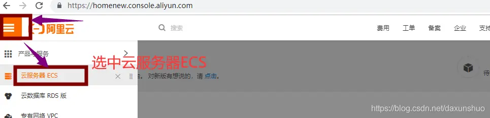
## 2、重做服务器系统 --- 并不是必须

 image

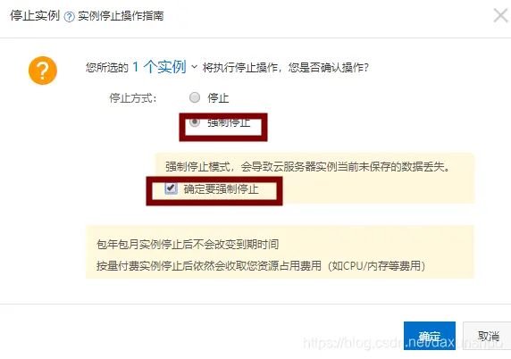

 

第一可以更换操作系统

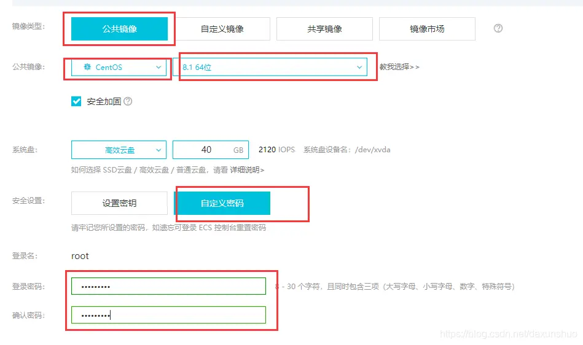

第二可以重新初始化磁盘（跟第一选一个）

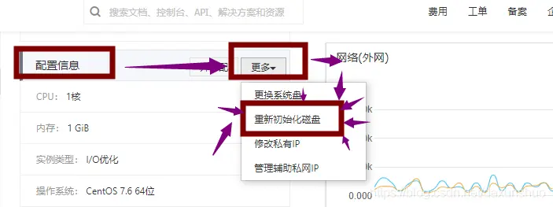

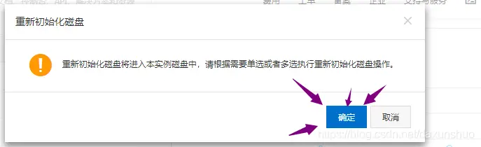


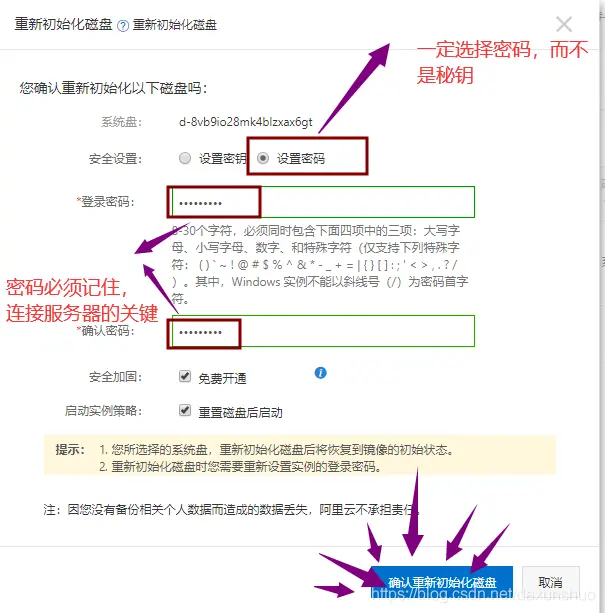


 

 

## 3、准备连接服务器的工具


点击 [finalshell](https://links.jianshu.com/go?to=http%3A%2F%2Fmydown.yesky.com%2Fpcsoft%2F413551229.html) 

## 4. 连接服务器


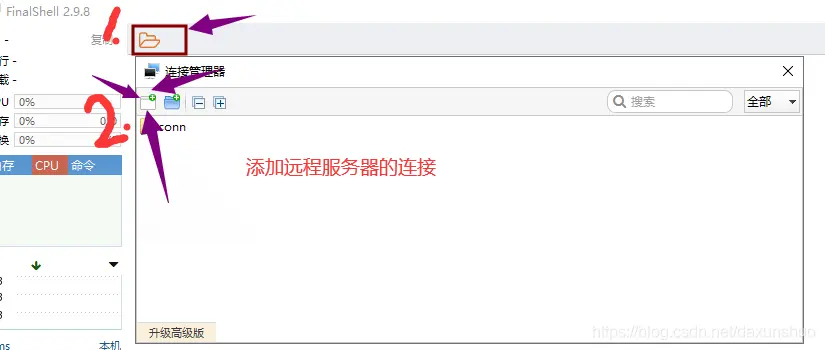

选择 SSH 连接

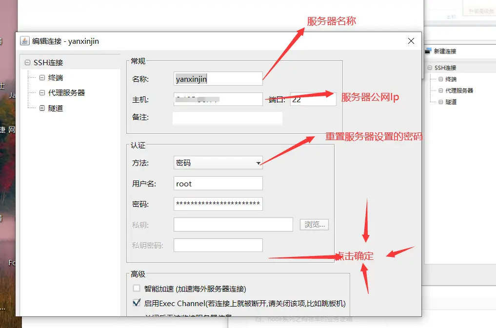 

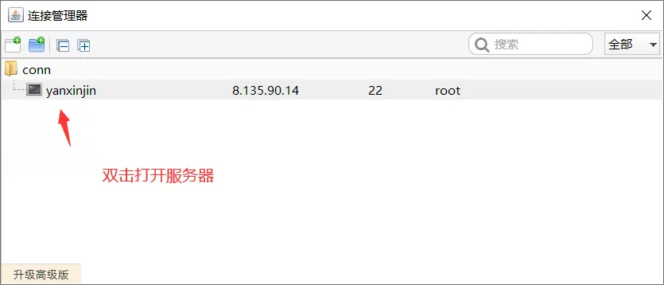 

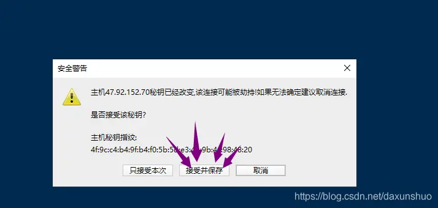

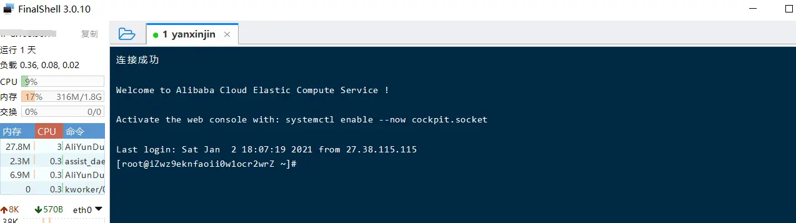 
## 5、nginx 介绍

Nginx 是一款轻量级的 Web 服务器 / 反向代理服务器及电子邮件（IMAP/POP3）代理服务器，在 BSD-like 协议下发行。其特点是占有内存少，并发能力强，事实上 nginx 的并发能力确实在同类型的网页服务器中表现较好，中国大陆使用 nginx 网站用户有：百度、京东、新浪、网易、腾讯、淘宝等。  
负载均衡、反向代理

## 6、安装 nginx


```
yum install -y nginx
```

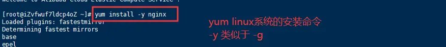 

设置开机启动

```
systemctl start nginx.service
systemctl enable nginx.service
```

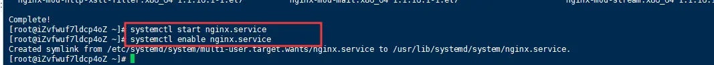 

浏览器输入服务器公网 IP 地址查看效果


由于 nginx 默认使用端口 80， ecs 实例没有开启端口 80，默认只有 22 和 3389


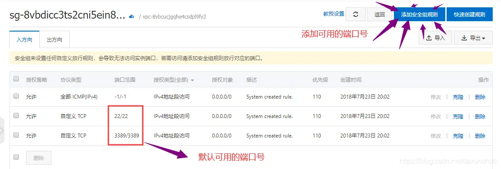

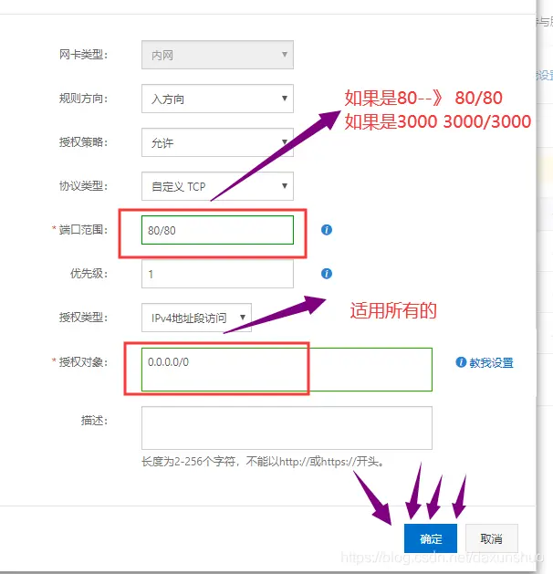

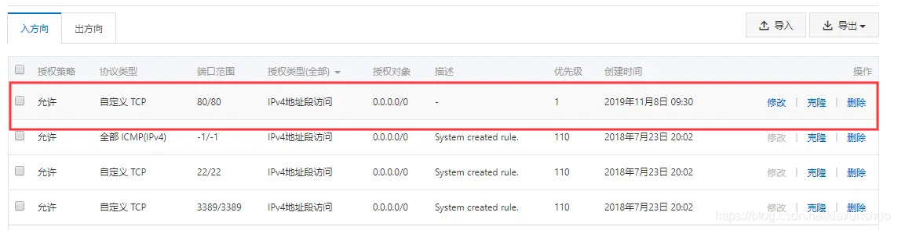

此时浏览器再次访问，表明当前服务器中 nginx 安装配置完成

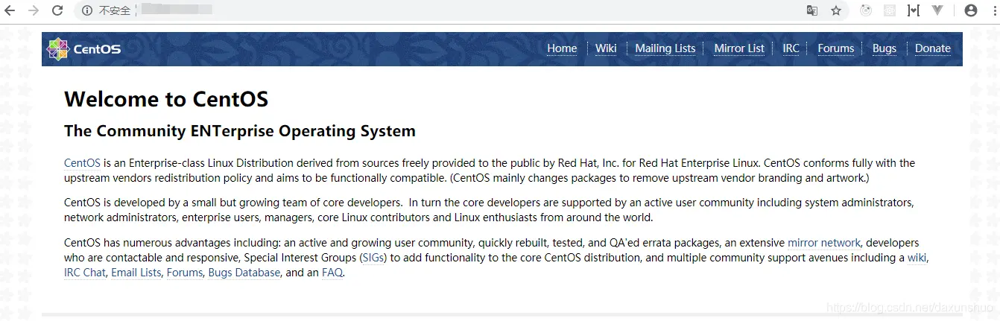image

## 7、然后使用域名代替 访问服务器 IP


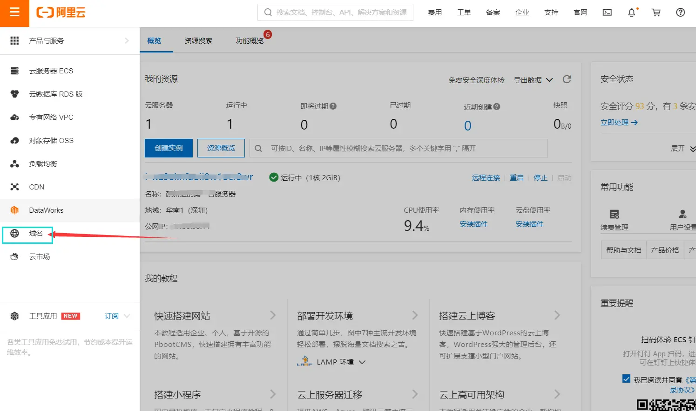 image.png

 image.png

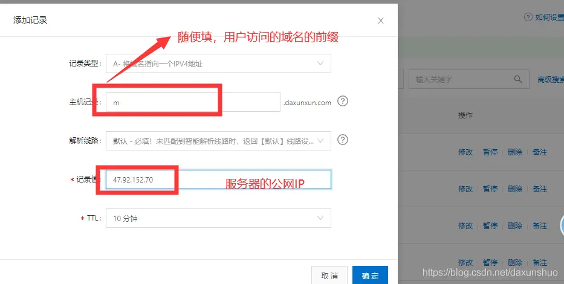image

然后就可以通过域名访问了

## 9、最最最最最终要的来了！！！


想让域名显示自己想要的页面 则需要提前准备一个 index.html 文件（这里不用项目部署）简单实现页面的渲染

### 1. 命令行输入

```
cd /usr/share/nginx/html
```

### 2. 将提前准备好的 index.html 文件拖入替换掉原来的 index.html 文件

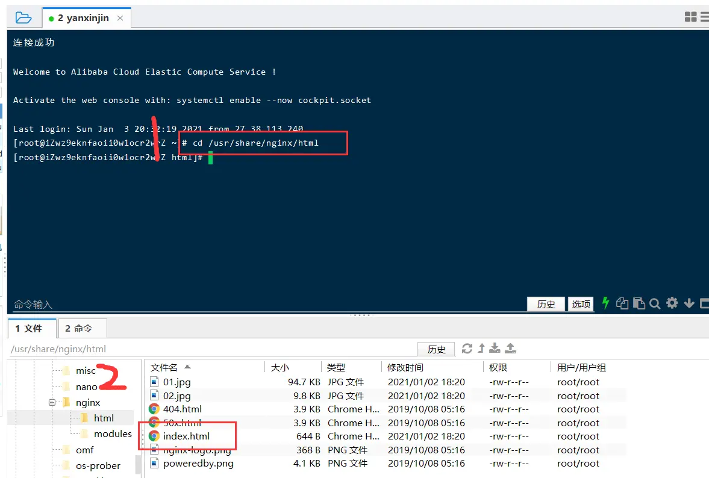 image.png

再次访问域名就成功了。

