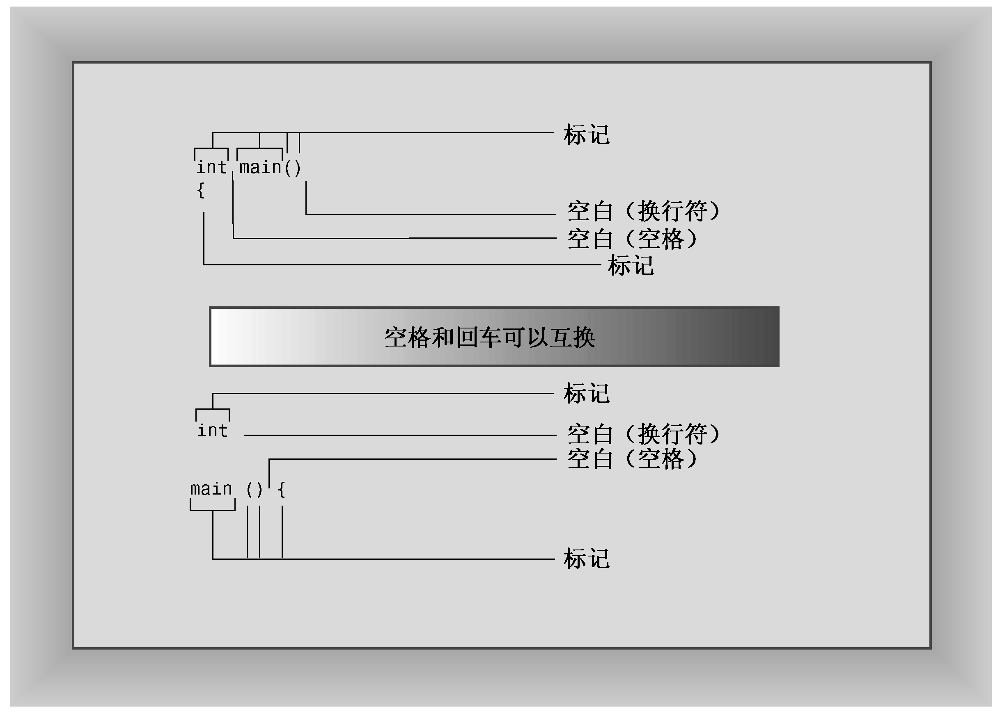

# 开始学习C++

## 进入C++

大小写敏感
注释 `//` 开头

```cpp
// myfirst.cpp -- 显示一条消息

#include <iostream>
int main(){
    using namespace std;
    cout << "Come up and C++ me some time.";
    cout << endl;   //换行
    cout << " You won't regret it!" << endl;
    return 0;
}
```

些窗口环境在独立的窗口中运行程序，并在程序运行完毕后自动关闭该窗口。正如第1章讨论的，要让窗口一直打开，直到您按任何键，可在return语句前添加如下语句：

```cpp
cin.get();
```

### `main()` 函数

```cpp
int main()
{
	statements
	return 0;
}
```


**1．作为接口的函数头**

C++句法要求main( )函数的定义以函数头 `int main()` 开始。

通常，main( )被启动代码调用，而启动代码是由编译器添加到程序中的，是程序和操作系统（UNIX、Windows 7或其他操作系统）之间的桥梁。事实上，**该函数头描述的是main( )和操作系统之间的接口**。

在C语言中，省略返回类型相当于说函数的类型为int。C++不推荐这种写法，容易误会为没有返回值
```cpp
main() // 经典函数头，不推荐
```

在括号中使用关键字void明确地指出，函数不接受任何参数。==在C++（不是C）中，让括号空着与在括号中使用void等效（在C中，让括号空着意味着对是否接受参数保持沉默）==。
```cpp
int main(void) // 推荐的函数头，C++标准
```

> [!warning] C 与 C++ 形参为空时的差异
在C语言中，可以给无参数的函数传送任意类型的参数
在C++中，不能向无参数的函数传送任何参数，否则编译会出错。
```cpp
int main() // 一个无参函数
```

非标准，不推荐的函数头
```cpp
void main()
```

只适用于main函数的隐含返回语句
```cpp
// 如果编译器到达main( )函数末尾时没有遇到返回语句，则认为main( )函数以如下语句结尾：
return 0;
```
其余函数必须显示的以return结束

### C++ 注释

C++注释以双斜杠 `//` 打头

C++注释以 `//` 打头，到行尾结束。注释可以位于单独的一行上，也可以和代码位于同一行。

C-风格注释
```cpp
#include <iostream> /* a C-style comment*/
```

由于C-风格注释以*/结束，而不是到行尾结束，因此可以跨越多行。可以在程序中使用C或C++风格的注释，也可以同时使用这两种注释。但应==尽量使用C++注释==，因为这不涉及到结尾符号与起始符号的正确配对，所以它产生问题的可能性很小。

### C++预处理器和iostream文件

使用了 `#include` 编译指令
```cpp
#include <iostream> // 预处理器指令
```

该编译指令导致预处理器将iostream文件的内容添加到程序中。这是一种典型的预处理器操作：在源代码被编译之前，替换或添加文本。

`#include` 编译指令导致iostream文件的内容随源代码文件的内容一起被发送给编译器。实际上，iostream文件的内容将取代程序中的代码行`#include <iostream>`。原始文件没有被修改，而是将源代码文件和iostream组合成一个复合文件，编译的下一阶段将使用该文件。

### 头文件名

像iostream这样的文件叫做包含文件（include file）—由于它们被包含在其他文件中；也叫头文件（header file）—由于它们被包含在文件起始处。
C语言的传统是，头文件使用扩展名h，将其作为一种通过名称标识文件类型的简单方式。但C++的用法变了。现在，对老式C的头文件保留了扩展名h（C++程序仍可以使用这种文件），而==C++头文件则没有扩展名==。

有些C头文件被转换为C++头文件，这些文件被重新命名，去掉了扩展名h（使之成为C++风格的名称），并在文件名称前面加上前缀c（表明来自C语言）。
例如，C++版本的math.h为cmath。有时C头文件的C版本和C++版本相同，而有时候新版本做了一些修改。

对于纯粹的C++头文件（如iostream）来说，去掉h不只是形式上的变化，没有h的头文件也可以包含名称空间

**头文件命名约定**

| 头文件类型   |    约定    | 示例         | 说明                                  |
| ------- | :------: | ---------- | ----------------------------------- |
| C++旧式风格 |    .h    | iostream.h | C++程序可以使用                           |
| C旧式风格   |    .h    | math.h     | C、C++程序可以使用                         |
| C++新式风格 |   无扩展名   | iostream   | C++程序可以使用，使用namespace std           |
| 转换后的C   | 前缀C，无扩展名 | cmath      | C++程序可以使用，可以使用不是C的特性，如namespace std |


### 名称空间

如果使用iostream，而不是iostream.h，则应使用下面的名称空间编译指令来使iostream中的定义对程序可用：
```cpp
using namespace std;
```

名称空间支持是一项C++特性，旨在让您编写大型程序以及将多个厂商现有的代码组合起来的程序时更容易，它还有助于组织程序。一个潜在的问题是，可能使用两个已封装好的产品，而它们都包含一个名为wanda( )的函数。这样，使用wanda( )函数时，编译器将不知道指的是哪个版本。名称空间让厂商能够将其产品封装在一个叫做名称空间的单元中，这样就可以用名称空间的名称来指出想使用哪个厂商的产品。因此，Microflop Industries可以将其定义放到一个名为Microflop的名称空间中。这样，其wanda( )函数的全称为Microflop::wanda( )；同样，Piscine公司的wanda( )版本可以表示为Piscine::wanda( )。这样，程序就可以使用名称空间来区分不同的版本了：

```
Microflop::wanda("go dancing?");
Priscine::wanda("a fish named Desire");
```


下面的一行代码表明，使用std名称空间中定义的名称，而不必使用std::前缀：
```cpp
using namespace std;
```
这个using编译指令使得std名称空间中的所有名称都可用。

只使所需的名称可用，这可以通过使用using声明来实现：
```cpp
using std::cout;
using std::endl;
using std::cin;
```

### 使用cout进行C++输出

从概念上看，输出是一个流，即从程序流出的一系列字符。
cout对象表示这种流，其属性是在iostream文件中定义的。
cout的对象属性包括一个插入运算符（<<），它可以将其右侧的信息插入到流中。

```cpp
cout << "Come up and C++ me some time"
```
它将字符串“Come up and C++ me some time.”插入到输出流中。因此，与其说程序显示了一条消息，不如说它将一个字符串插入到了输出流中。


C++，则可能注意到了，插入运算符（<<）看上去就像按位左移运算符（<<），这是一个运算符重载的例子，通过重载，同一个运算符将有不同的含义。

**1．控制符endl**

```cpp
cout << endl
```

endl是一个特殊的C++符号，表示一个重要的概念：重起一行。在输出流中插入endl将导致屏幕光标移到下一行开头。

和cout一样，endl也是在头文件iostream中定义的，且位于名称空间std中。

**2．换行符**

C++还提供了另一种在输出中指示换行的旧式方法：C语言符号\n：

```cpp
cout << "What's next?\n"; // \n 换行，新起一行
```

`\n` 被视为一个字符，名为换行符。

显示字符串时，用 `\n` 可以减少代码量
```cpp
cout << "梦想总是要有的\n";
cout << "梦想躺平" << endl;
```

如果要生成一个空行，则两种方法的输入量相同，但对大多数人而言，==输入endl更为方便==：
```cpp
cout << "\n";
cout << endl;
```

> [!info] `\n` 和 endl 的区别
> endl确保程序继续运行前刷新输出（将其立即显示在屏幕上）；而使用“\n”不能提供这样的保证（他是一个字符，可能在缓冲区），这意味着在有些系统中，有时可能在您输入信息后才会出现提示。

### C++源代码的格式化

C++中，分号标示了语句的结尾。因此，在C++中，回车的作用就和空格或制表符相同。

但是也必须遵守一些规则，具体地说，在C和C++中，==不能把空格、制表符或回车放在元素（比如名称）中间，也不能把回车放在字符串中间。==，然而，C++11新增的原始（raw）字符串可包含回车，这

**1．源代码中的标记和空白**

一行代码中不可分割的元素叫做标记。通常，必须用空格、制表符或回车将两个标记分开，空格、制表符和回车统称为空白（white space）。




**2．C++源代码风格**

* 每条语句占一行
* 每个函数都有一个开始花括号和一个结束花括号，这两个花括号各占一行
* 函数中的语句都相对于花括号进行缩进
* 与函数名称相关的圆括号周围没有空白

## C++语句

```
#include <iostream>
using namespace  std;
int main(){
    int carrots;
    carrots = 25;
    cout << "I have ";
    cout << carrots;
    cout << " carrots.";
    cout << endl;
    carrots = carrots - 1;
    cout << "Crunch,crunch. Now I have "<< carrots << " carrots." << endl;
}
```

### 声明语句和变量

计算机是一种精确的、有条理的机器。要将信息项存储在计算机中，必须指出信息的存储位置和所需的内存空间。

```
int carrots;
```
这条语句提供了两项信息：需要的内存以及该内存单元的名称。

程序中的声明语句叫做定义声明（defining declaration）语句，简称为定义（definition）。
这意味着它将导致编译器为变量分配内存空间。在较为复杂的情况下，还可能有引用声明（reference declaration）。

通常，声明不一定是定义，但在这个例子中，声明是定义。

在C和Pascal中，所有的变量声明通常都位于函数或过程的开始位置，但C++没有这种限制。

> 对于声明变量，C++的做法是尽可能在首次使用变量前声明它。

### 赋值语句

赋值语句将值赋给存储单元。例如，下面的语句将整数25赋给变量carrots表示的内存单元：
```cpp
carrots = 25;
```


可以连续使用赋值运算符
```cpp
int steinway;
int baldwin;
int yamaha;
yamaha = baldwin = steinway = 88;
```
赋值将从右向左进行。首先，88被赋给steinway；然后，steinway的值（现在是88）被赋给baldwin；然后baldwin的值88被赋给yamaha（C++遵循C的爱好，允许外观奇怪的代码）。

### cout 的新花样

```cpp
cout << carrots
```

程序没有打印“carrots”，而是打印存储在carrots中的整数值，即25。实际上，这将两个操作合而为一了。
首先，cout将carrots替换为其当前值25；
然后，把值转换为合适的输出字符。

**cout更智能**

与老式C语言的区别在于cout的聪明程度。在C语言中，要打印字符串“25”和整数25，可以使用C语言的多功能输出函数printf( )：
撇开printf( )的复杂性不说，必须用特殊代码（%s和%d）来指出是要打印字符串还是整数。如果让printf( )打印字符串，但又错误地提供了一个整数，由于printf( )不够精密，因此根本发现不了错误。它将继续处理，显示一堆乱码。

**cout的实现**

cout的智能行为源自C++的面向对象特性。实际上，C++插入运算符（<<）将根据其后的数据类型相应地调整其行为，这是一个运算符重载的例子。在后面的章节中学习函数重载和运算符重载时，将知道如何实现这种智能设计。

**cout是可扩展的**

cout还有明显的优点。它能够识别类型的功能表明，其设计更灵活、更好用。另外，它是可扩展的（extensible）。也就是说，可以重新定义<<运算符，使cout能够识别和显示所开发的新数据类型。


## 其他C++语句

### cin

```cpp
cin >> carrots
```

从这条语句可知，信息从cin流向carrots。显然，对这一过程有更为正式的描述。就像C++将输出看作是流出程序的字符流一样，它也将输入看作是流入程序的字符流。iostream文件将cin定义为一个表示这种流的对象。输出时，<<运算符将字符串插入到输出流中；输入时，cin使用>>运算符从输入流中抽取字符。


与cout一样，==cin也是一个智能对象==。它可以将通过键盘输入的一系列字符（即输入）转换为接收信息的变量能够接受的形式。在这个例子中，程序将carrots声明为一个整型变量，因此输入被转换为计算机用来存储整数的数字形式。


## 函数


### 使用有返回值的函数

```
x =sqrt(6.25);
```

6.25 带小数部分的数字默认类型为 `double`

函数原型
```cpp
// 返回值类型 函数名(参数类型)
int func(int,double);
```
函数原型之于函数就像变量声明之于变量

sqrt( ) 的函数原型
```cpp
double sqrt(double);
```

原型结尾的分号表明它是一条语句，这使得它是一个原型，而不是函数头。如果省略分号，编译器将把这行代码解释为一个函数头，并要求接着提供定义该函数的函数体。

不要混淆函数原型和函数定义。可以看出，==原型只描述函数接口。也就是说，它描述的是发送给函数的信息和返回的信息。而定义中包含了函数的代码，如计算平方根的代码。==C和C++将库函数的这两项特性（原型和定义）分开了。==库文件中包含了函数的编译代码，而头文件中则包含了原型。==

应在首次使用函数之前提供其原型。通常的做法是把原型放到main( )函数定义的前面。

```cpp
#include <iostream>
#include <cmath>

int main(){
    using namespace std;

    double area;
    cout << "请输入一个正方形面积 ";
    cin >> area;
    double side;
    side = sqrt(area);
    cout << "正方形的边长是 " << side
         << endl;
    return 0;
}
```

如果运行程序清单2.4时，将得到一条消息，指出_sqrt是一个没有定义的外部函数（似乎应当避免），则很可能是由于编译器不能自动搜索数学库（编译器倾向于给函数名添加下划线前缀—提示它们对程序具有最后的发言权）。如果在UNIX实现中遇到这样的消息，可能需要在命令行结尾使用-lm选项：
```
CC sqrt.c -lm
```

linux中
```
g++ sqrt.C -lm
```

C++还允许在创建变量时对它进行赋值
```cpp
double side = sqrt(area);
```
这个过程叫做初始化（initialization）

### 函数变体

**一些函数原型**

两个参数
```cpp
double pow(double,double)
```

不接受任何参数
```cpp
int rand(void);
```

无返回值
```cpp
void bucks()
```

### 用户定义的函数

```cpp
#include <iostream>

void simon(int); // 函数原型 ,声明必须在调用之前，定义可以放main后面，结构更清晰

int main(){

    using namespace std;

    simon(3); //调用 simon
    cout << "输入一个数：";
    int count;
    cin >> count;
    simon(count);
    cout << "完成！" << endl;

    return 0;
}

void simon(int n){
    using namespace std;
    cout << "你键入了 " << n << endl;
}
```

**1．函数格式**

```cpp
type functionname(argumentlist){
	statements
}
```

C++不允许将函数定义嵌套在另一个函数定义中。每个函数定义都是独立的，所有函数的创建都是平等的

**2．函数头**

```
int main()
```
空括号（其中可以包含void）表明，main( )没有参数。对于有返回值的函数，应使用关键字return来提供返回值，并结束函数。

main函数的返回值去哪了？
答案是，可以将计算机操作系统（如UNIX或Windows）看作调用程序。因此，main( )的返回值并不是返回给程序的其他部分，而是返回给操作系统。很多操作系统都可以使用程序的返回值。例如，UNIX外壳脚本和Windows命令行批处理文件都被设计成运行程序，并测试它们的返回值（通常叫做退出值）。通常的约定是，退出值为0则意味着程序运行成功，为非零则意味着存在问题。因此，如果C++程序无法打开文件，可以将它设计为返回一个非零值。然后，便可以设计一个外壳脚本或批处理文件来运行该程序，如果该程序发出指示失败的消息，则采取其他措施。

### 用户定义的有返回值的函数

函数原型描述了函数接口，即函数如何与程序的其他部分交互。参数列表指出了何种信息将被传递给函数，函数类型指出了返回值的类型。程序员有时将函数比作一个由出入它们的信息所指定的黑盒子（black boxes）（电工用语）。函数原型将这种观点诠释得淋漓尽致


函数stonetolb( )短小、简单，但包含了全部的函数特性：
- 有函数头和函数体；
- 接受一个参数；
- 返回一个值；
- 需要一个原型。
可以把stonetolb( )看作函数设计的标准格式

### 在多函数程序中使用using编译指令

在程序清单2.5中，两个函数中都包含下面一条using编译指令：
```
using namespace std;
```

可以采用另一种方法让两个函数都能够访问名称空间std，即将编译指令放在函数的外面，且位于两个函数的前面：

```cpp
#include <iostream>
using namespace std;

void simon(int); // 函数原型

int main(){
    simon(3); //调用 simon
    cout << "输入一个数：";
    int count;
    cin >> count;
    simon(count);
    cout << "完成！" << endl;
    return 0;
}

void simon(int n){
    cout << "你键入了 " << n << endl;
}
```

总之，让程序能够访问名称空间std的方法有多种，下面是其中的4种。

* 将using namespace std；放在函数定义之前，让文件中所有的函数都能够使用名称空间std中所有的元素。
* 将using namespace std；放在特定的函数定义中，让该函数能够使用名称空间std中的所有元素。
* 在特定的函数中使用类似using std::cout;这样的编译指令，而不是using namespace std;，让该函数能够使用指定的元素，如cout。
* 完全不使用编译指令using，而在需要使用名称空间std中的元素时，使用前缀std::，如下所示：
```cpp
std::cout << "梦很美满" << std::endl;
```

**命名约定**

函数名称
```cpp
Myfunction( )
myfunction( )
myFunction( )
my_function( )
my_funct( )
```

## 总结

有多种类型的C++语句，包括下述6种。

声明语句：定义函数中使用的变量的名称和类型。
赋值语句：使用赋值运算符（=）给变量赋值。
消息语句：将消息发送给对象，激发某种行动。
函数调用：执行函数。被调用的函数执行完毕后，程序返回到函数调用语句后面的语句。
函数原型：声明函数的返回类型、函数接受的参数数量和类型。
返回语句：将一个值从被调用的函数那里返回到调用函数中。

