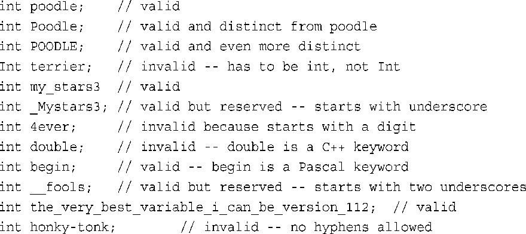
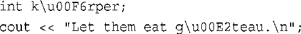
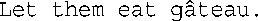

# 处理数据

## 简单变量

### 变量名

必须遵循几种简单的C++命名规则。

- 在名称中只能使用字母字符、数字和下划线 `_` 。
- 名称的第一个字符不能是数字。
- 区分大写字符与小写字符。
- 不能将C++关键字用作名称。
- 以两个下划线或下划线和大写字母打头的名称被保留给实现（编译器及其使用的资源）使用。以一个下划线开头的名称被保留给实现，用作全局标识符。
- C++对于名称的长度没有限制，名称中所有的字符都有意义，但有些平台有长度限制。



### 整型

整数就是没有小数部分的数字，如2、98、-5286和0。

C++的基本整型（按宽度递增的顺序排列）分别是char、short、int、long和C++11新增的long long，其中每种类型都有符号版本和无符号版本，因此总共有10种类型可供选择。

### 整型short、int、long和long long

C++提供了一种灵活的标准，它确保了最小长度（从C语言借鉴而来），如下所示：

- short至少16位；
- int至少与short一样长；
- long至少32位，且至少与int一样长；
- long long至少64位，且至少与long一样长。

**位与字节**

> [!warning] C与C++的字节定义
> 1个字节等于8个位只是惯例而已，C标准并没有定义这一点。
> C++字节由至少能够容纳实现的基本字符集的相邻位组成，也就是说，可能取值的数目必须等于或超过字符数目。在美国，基本字符集通常是ASCII和EBCDIC字符集，它们都可以用8位来容纳，所以在使用这两种字符集的系统中，C++字节通常包含8位。然而，国际编程可能需要使用更大的字符集，如Unicode，因此有些实现可能使用16位甚至32位的字节。有些人使用术语八位组（octet）表示8位字节。


可以像使用int一样，使用这些类型名来声明变量：
```cpp
short score;
int temperature;
long position;
```
实际上，short是short int的简称，而long是long int的简称，但是程序设计者们几乎都不使用比较长的形式。

这4种类型（int、short、long和long long）都是符号类型，这意味着每种类型的取值范围中，负值和正值几乎相同。例如，16位的int的取值范围为-32768到+32767。

**如何确定系统中整数的最大长度**

sizeof运算符返回类型或变量的长度，单位为字节。“字节”的含义依赖于实现，因此在一个系统中，两字节的int可能是16位，而在另一个系统中可能是32位。

头文件climits（在老式实现中为limits.h）中包含了关于整型限制的信息。
例如，INT_MAX为int的最大取值，CHAR_BIT为字节的位数。

程序清单3.1演示了如何使用这些工具。该程序还演示如何初始化，即使用声明语句将值赋给变量。

```cpp
#include <iostream>
#include <climits>
int main(){
    using namespace std;
    int n_int = INT_MAX; // 初始化 n_int 为最大 int 值
    short n_short = SHRT_MAX; // 几号被定义在 climits 文件
    long n_long = LONG_MAX;
    long long n_llong = LLONG_MAX;

    // sizeof 确定类型的大小，单位字节
    cout << "int is " << sizeof (int) << " bytes." << endl;
    cout << "short is " << sizeof n_short << "bytes." << endl;
    cout << "long is " << sizeof n_long << "bytes." << endl;
    cout << "long long is " << sizeof n_llong << "bytes." << endl;
    cout << endl;

    cout << "最大值： " << endl;
    cout << "int: " << n_int << endl;
    cout << "short: " << n_short << endl;
    cout << "long: " << n_long << endl;
    cout << "long long: " << n_llong << endl;
    cout << endl;

    cout << "int 最小值 = " << INT_MIN << endl; 
    cout << "每字节比特 = " << CHAR_BIT << endl; // 确定系统的一字节的位数
    return 0;
```

**1．运算符sizeof和头文件limits**

可对类型名或变量名使用sizeof运算符。对类型名（如int）使用sizeof运算符时，应将名称放在括号中；但对变量名（如n_short）使用该运算符，括号是可选的：

```cpp
cout << "int is " << sizeof (int) << "byte.\n";
cout << "short is " << sizeof n_short << " bytes.\n"
```

头文件climits定义了符号常量（参见本章后面的旁注“符号常量—预处理器方式”）来表示类型的限制。如前所述，INT_MAX表示类型int能够存储的最大值，对于Windows 7系统，为2 147 483 647。==编译器厂商提供了climits文==件，该文件指出了其编译器中的值。例如，在使用16位int的老系统中，climits文件将INT_MAX定义为32 767。


> climits中的符号常量

|    符号常量    |           表示           |
| :--------: | :--------------------: |
|  CHAR_BIT  |        char的位数         |
|  CHAR_MAX  |        char的最大值        |
|  CHAR_MIN  |        char的最小值        |
| SCHAR_MAX  |    signed char的最大值     |
| SCHAR_MIN  |    signed char的最小值     |
| UCHAR_MAX  |   unsigned char的最大值    |
|  SHRT_MAX  |       short的最大值        |
|  SHRT_MIN  |       short的最小值        |
| USHRT_MAX  |   unsigned short的最大值   |
|  INT_MAX   |        int的最大值         |
|  INT_MIN   |        int的最小值         |
|  UINT_MAX  |    unsigned int的最大值    |
|  LONG_MAX  |        long的最大值        |
|  LONG_MIN  |        long的最小值        |
| ULONG_MAX  |   unsigned long的最大值    |
| LLONG_MAX  |     long long的最大值      |
| LLONG_MIN  |     long long的最小值      |
| ULLONG_MAX | unsigned long long的最大值 |


> [!info] 符号常量—预处理器方式
climits文件中包含与下面类似的语句行：
`#define INT_MAX 32767`
在C++编译过程中，首先将源代码传递给预处理器。在这里，#define和#include一样，也是一个预处理器编译指令。该编译指令告诉预处理器：在程序中查找INT_MAX，并将所有的INT_MAX都替换为32767。因此#define编译指令的工作方式与文本编辑器或字处理器中的全局搜索并替换命令相似。修改后的程序将在完成这些替换后被编译。预处理器查找独立的标记（单独的单词），跳过嵌入的单词。也就是说，预处理器不会将PINT_MAXTM替换为P32767IM。也可以使用#define来定义自己的符号常量（参见程序清单3.2）。然而，#define编译指令是C语言遗留下来的。C++有一种更好的创建符号常量的方法（使用关键字const，将在后面的一节讨论），所以不会经常使用#define。然而，有些头文件，尤其是那些被设计成可用于C和C++中的头文件，必须使用#define。


**2．初始化**

初始化将赋值与声明合并在一起
```cpp
int n_int = INT_MAX
```

也可以使用字面值常量来初始化。
```cpp
int uncles =5
```

可以将变量初始化为另一个变量，条件是后者已经定义过。
```cpp
int aunts = uncles;
```

甚至可以使用表达式来初始化变量，条件是当程序执行到该声明时，表达式中所有的值都是已知的：
```cpp
int chairs = aunts + uncles + 4;
```

前面的初始化语法来自C语言，C++还有另一种C语言没有的初始化语法：
```cpp
int owls = 101 // 传统 C 初始化
int wrens(432); // C++ 语法 ，设置 wrens 为 432
```

> [!warning] 警告
> 如果不对函数内部定义的变量进行初始化，该变量的值将是不确定的。这意味着该变量的值将是它被创建之前，相应内存单元保存的值。

> 在声明变量时对它进行初始化，可避免以后忘记给它赋值的情况发生。

**3．C++11 初始化方式**

还有另一种初始化方式，这种方式用于数组和结构，但在C++98中，也可用于单值变量：
```cpp
int hamburgers = {24}; // set hamburgers to 24
```

首先，采用这种方式时，可以使用等号（=），也可以不使用：
```cpp
int emus{7} // set emus to 5
int rheas = {12} // set rheas to 12
```

其次，大括号内可以不包含任何东西。在这种情况下，变量将被初始化为零：
```cpp
int emus{}
int psychice = {}
```

### 无符号类型

前面介绍的4种整型都有一种不能存储负数值的无符号变体，其优点是可以增大变量能够存储的最大值。例如，如果short表示的范围为−32768到+32767，则无符号版本的表示范围为0-65535。当然，仅当数值不会为负时才应使用无符号类型，如人口、粒数等。要创建无符号版本的基本整型，只需使用关键字unsigned来修改声明即可：

```cpp
unsigned short change
```

注意，unsigned本身是unsigned int的缩写。

### 选择整型类型

C++提供了大量的整型，应使用哪种类型呢？通常，int被设置为对目标计算机而言最为“自然”的长度。自然长度（natural size）指的是计算机处理起来效率最高的长度。如果没有非常有说服力的理由来选择其他类型，则应使用int。

如果节省内存很重要，则应使用short而不是使用int，即使它们的长度是一样的。例如，假设要将程序从int为16位的系统移到int为32位的系统，则用于存储int数组的内存量将加倍，但short数组不受影响。请记住，节省一点就是赢得一点。

### 整型字面值

整型字面值（常量）是显式地书写的常量，如212或1776。与C相同，C++能够以三种不同的计数方式来书写整数：基数为10、基数为8（老式UNIX版本）和基数为16（硬件黑客的最爱）。附录A介绍了这几种计数系统；这里将介绍C++表示法。C++使用前一（两）位来标识数字常量的基数。如果第一位为1～9，则基数为10（十进制）；因此93是以10为基数的。如果第一位是0，第二位为1～7，则基数为8（八进制）；因此042的基数是8，它相当于十进制数34。如果前两位为0x或0X，则基数为16（十六进制）；因此0x42为十六进制数，相当于十进制数66。对于十六进制数，字符a～f和A～F表示了十六进制位，对应于10～15。0xF为15，0xA5为165（10个16加5个1）。程序清单3.3演示了这三种基数。

hexoct.cpp
```cpp
// 用 十进制 显示 八进制 和 16进制 数
#include <iostream>

int main(){
    using namespace std;
    int chest = 42;
    int waist = 0x42; // 16进制数
    int inseam = 042; // 八进制数
}
```

### char类型：字符和小整数

```cpp
char ch;
cin >> ch ;
```

```cpp
cout.put() // 显示一个字符
```

3.6 morechar.cpp
```cpp
char ch = 'M'
int i = ch;
cout << ch; 
cout << i;
```
输出
```cpp
M
77
```
在程序清单3.6中，‘M’表示字符M的数值编码，因此将char变量ch初始化为‘M’，将把c设置为77。然后，程序将同样的值赋给int变量i，这样ch和i的值都是77。接下来，cout把ch显示为M，而把i显示为77。

C++将字符表示为整数提供了方便，使得操纵字符值很容易。不必使用笨重的转换函数在字符和ASCII码之间来回转换。

即使通过键盘输入的数字也被视为字符。请看下面的代码：
```
char ch;
cin >> ch;
```
如果您输入5并按回车键，上述代码将读取字符“5”，并将其对应的字符编码（ASCII编码53）存储到变量ch中。

**通用字符名**

C++实现支持一个基本的源字符集，即可用来编写源代码的字符集

通用字符名的用法类似于转义序列。通用字符名可以以\u或\U打头。\u后面是8个十六进制位，\U后面则是16个十六进制位。这些位表示的是字符的ISO 10646码点（ISO 10646是一种正在制定的国际标准，为大量的字符提供了数值编码，请参见本章后面的“Unicode和ISO 10646”）。

```cpp
int k\u00F6rper
```

如果所用的实现支持扩展字符，则可以在标识符（如字符常量）和字符串中使用通用字符名。例如，请看下面的代码：


ö的ISO 10646码点为00F6，而â的码点为00E2。因此，上述C++代码将变量名设置为körper，并显示下面的输出：


如果系统不支持ISO 10646，它将显示其他字符或gu00E2teau，而不是â。

实际上，从易读性的角度看，在变量名中使用\u00F6没有多大意义，但如果实现的扩展源字符集包含ö，它可能允许您从键盘输入该字符。

请注意，C++使用术语“通用编码名”，而不是“通用编码”，这是因为应将\u00F6解释为“Unicode码点为U-00F6的字符”。支持Unicode的编译器知道，这表示字符ö，但无需使用内部编码00F6。无论计算机使用是ASCII还是其他编码系统，都可在内部表示字符T；同样，在不同的系统中，将使用不同的编码来表示字符ö。在源代码中，可使用适用于所有系统的通用编码名，而编译器将根据当前系统使用合适的内部编码来表示它。

**signed char和unsigned char**

与int不同的是，char在默认情况下既不是没有符号，也不是有符号。是否有符号由C++实现决定，这样编译器开发人员可以最大限度地将这种类型与硬件属性匹配起来。如果char有某种特定的行为对您来说非常重要，则可以显式地将类型设置为signed char 或unsigned char

**wcha_t**

程序需要处理的字符集可能无法用一个8位的字节表示，如日文汉字系统。对于这种情况，C++的处理方式有两种。首先，如果大型字符集是实现的基本字符集，则编译器厂商可以将char定义为一个16位的字节或更长的字节。其次，一种实现可以同时支持一个小型基本字符集和一个较大的扩展字符集。8位char可以表示基本字符集，另一种类型wchar_t（宽字符类型）可以表示扩展字符集。wchar_t类型是一种整数类型，它有足够的空间，可以表示系统使用的最大扩展字符集。这种类型与另一种整型（底层（underlying）类型）的长度和符号属性相同。对底层类型的选择取决于实现，因此在一个系统中，它可能是unsigned short，而在另一个系统中，则可能是int。

cin和cout将输入和输出看作是char流，因此不适于用来处理wchar_t类型。iostream头文件的最新版本提供了作用相似的工具—wcin和wcout，可用于处理wchar_t流。另外，可以通过加上前缀L来指示宽字符常量和宽字符串。下面的代码将字母P的wchar_t版本存储到变量bob中，并显示单词tall的wchar_t版本：

```cpp
wchar_t bob = L'P';
wcout << L"tall" << endl;
```

在支持两字节wchar_t的系统中，上述代码将把每个字符存储在一个两个字节的内存单元中。本书不使用宽字符类型，但读者应知道有这种类型，尤其是在进行国际编程或使用Unicode或ISO 10646时。

**C++11新增的类型：char16_t和char32_t**

随着编程人员日益熟悉Unicode，类型wchar_t显然不再能够满足需求。事实上，在计算机系统上进行字符和字符串编码时，仅使用Unicode码点并不够。具体地说，进行字符串编码时，如果有特定长度和符号特征的类型，将很有帮助，而类型wchar_t的长度和符号特征随实现而已。因此，C++11新增了类型char16_t和char32_t，其中前者是无符号的，长16位，而后者也是无符号的，但长32位。C++11使用前缀u表示char16_t字符常量和字符串常量，如u‘C’和u“be good”；并使用前缀U表示char32_t常量，如U‘R’和U“dirty rat”。类型char16_t与/u00F6形式的通用字符名匹配，而类型char32_t与/U0000222B形式的通用字符名匹配。前缀u和U分别指出字符字面值的类型为char16_t和char32_t：

```cpp
char16_t ch1=u'q';
char32_t ch2=u'\U0000222B';
```

### bool类型

C++将非零值解释为true，将零解释为false。然而，现在可以使用bool类型来表示真和假了，它们分别用预定义的字面值true和false表示。
```cpp
bool is_ready = true;
```

字面值true和false都可以通过提升转换为int类型，true被转换为1，而false被转换为0：
```cpp
int ans = true ; // ans assigned 1
```

另外，任何数字值或指针值都可以被隐式转换（即不用显式强制转换）为bool值。任何非零值都被转换为true，而零被转换为false：
```cpp
bool start = -100 ; //start assigned true
```

## const限定符

C++有一种更好的处理符号常量的方法，这种方法就是使用const关键字来修改变量声明和初始化。
```cpp
const int Months = 12;
```

创建常量的通用格式如下：
```cpp
const type name = value;
```

如果在声明常量时没有提供值，则该常量的值将是不确定的，且无法修改。:
```cpp
const int a;
a = 12; //error 
```

> 在C++（而不是C）中可以用const值来声明数组长度

