# 复合类型

## 数组

### C++11数组初始化方法

首先，初始化数组时，可省略等号（=）：
```cpp
double earnings[4] { 1.2e4,1.6e4 }
```

其次，可不在大括号内包含任何东西，这将把所有元素都设置为零：
```cpp
unsigned counts[10] = {};
float balances[100] {};
```

第三，列表初始化禁止==缩窄转换==，

```cpp
long plifs[4] = {25,92,3.0};// error 第一条语句不能通过编译，因为将浮点数转换为整型是缩窄操作，即使浮点数的小数点后面为零。
```


## 字符串

用引号括起的字符串隐式地包括结尾的空字符，因此不用显式地包括它（参见图4.2）。另外，各种C++输入工具通过键盘输入，将字符串读入到char数组中时，将自动加上结尾的空字符（如果在运行程序清单4.1中的程序时发现，必须使用关键字static来初始化数组，则初始化上述char数组时也必须使用该关键字）
```cpp
char bird[11] = "Mr. Cheeps";
char fish[] = "Bubbles"
```

> 在确定存储字符串所需的最短数组时，别忘了将结尾的空字符计算在内。


### 拼接字符串常量

C++允许拼接字符串字面值，即将两个用引号括起的字符串合并为一个。
```
cout << "i am dog " "but you not" ;
```

```
cout << "i am dog "
"but you not" ;
```

注意，拼接时不会在被连接的字符串之间添加空格，第二个字符串的第一个字符将紧跟在第一个字符串的最后一个字符（不考虑\0）后面。第一个字符串中的\0字符将被第二个字符串的第一个字符取代。

### 数组输入字符串

cin 只能按空白符输入

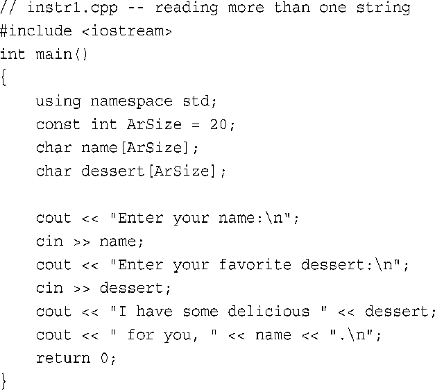

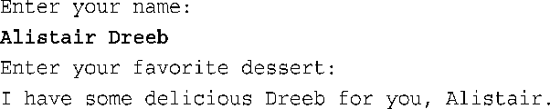


==cin使用空白（空格、制表符和换行符）来确定字符串的结束位置，这意味着cin在获取字符数组输入时只读取一个单词。==读取该单词后，cin将该字符串放到数组中，并自动在结尾添加空字符。

cin把Alistair作为第一个字符串，并将它放到name数组中。这把Dreeb留在输入队列中。当cin在输入队列中搜索用户喜欢的甜点时，它发现了Dreeb，因此cin读取Dreeb，并将它放到dessert数组中


### 每次读取一行字符串输入

get 按回车输入一行

**1. 面向行的输入：getline( )**

getline( )函数读取整行，它使用通过回车键输入的换行符来确定输入结尾。要调用这种方法，可以使用cin.getline( )。

该函数有两个参数。第一个参数是用来存储输入行的数组的名称，第二个参数是要读取的字符数。

如果这个参数为20，则函数最多读取19个字符，余下的空间用于存储自动在结尾处添加的空字符。getline( )成员函数在读取指定数目的字符或遇到换行符时停止读取。

```cpp
cin.getline(name,20)
```

它通过换行符来确定行尾，但==不保存换行符==。相反，在存储字符串时，它==用空字符来替换换行符==

**2. 面向行的输入：get( )**

其中一种变体的工作方式与getline( )类似，它们接受的参数相同，解释参数的方式也相同，并且都读取到行尾。但==get并不再读取并丢弃换行符，而是将其留在输入队列中==。假设我们连续两次调用get( )：

```cpp
cin.get(name,ArSize);
cin.get(dessert,Arsize);
```

由于第一次调用后，换行符将留在输入队列中，因此第二次调用时看到的第一个字符便是换行符。因此get( )认为已到达行尾，而没有发现任何可读取的内容。如果不借助于帮助，get( )将不能跨过该换行符。

幸运的是，get( )有另一种变体。==使用不带任何参数的cin.get( )调用可读取下一个字符（即使是换行符）==，因此可以用它来处理换行符，为读取下一行输入做好准备。也就是说，可以采用下面的调用序列：

```cpp
cin.get(name,ArSize);
cin.get();
cin.get(dessert,Arsize);
```

另一种使用get( )的方式是将两个类成员函数拼接起来（合并），如下所示：
```
cin.get(name,ArSize).get;
```
之所以可以这样做，是由于cin.get（name，ArSize）返回一个cin对象，该对象随后将被用来调用get( )函数。同样，下面的语句将把输入中连续的两行分别读入到数组name1和name2 中，其效果与两次调用cin.getline( )相同：
```cpp
cin.get(name,ArSize).getline(name,ArSize)
```


>为什么要使用get( )，而不是getline( )呢？首先，老式实现没有getline( )。其次，get( )使输入更仔细。例如，假设用get( )将一行读入数组中。如何知道停止读取的原因是由于已经读取了整行，而不是由于数组已填满呢？查看下一个输入字符，如果是换行符，说明已读取了整行；否则，说明该行中还有其他输入。第17章将介绍这种技术。总之，getline( )使用起来简单一些，但get( )使得检查错误更简单些。可以用其中的任何一个来读取一行输入；只是应该知道，它们的行为稍有不同。

**3．空行和其他问题**

当getline( )或get( )读取空行时，将发生什么情况？最初的做法是，下一条输入语句将在前一条getline( )或get( )结束读取的位置开始读取；但当前的做法是，当get( )（不是getline( )）读取空行后将设置失效位（failbit）。这意味着接下来的输入将被阻断，但可以用下面的命令来恢复输入：

```
cin.clear();
```

另一个潜在的问题是，输入字符串可能比分配的空间长。如果输入行包含的字符数比指定的多，则getline( )和get( )将把余下的字符留在输入队列中，而getline( )还会设置失效位，并关闭后面的输入。

第5、6章和第17章将介绍这些属性，并探讨程序如何避免这些问题。


### 混合输入字符串和数字

```cpp
int year;
char address[20];
cin >> year;
cin.getline(address,19);

输入 1996 回车
```

当cin读取年份，将回车键生成的换行符留在了输入队列中。后面的cin.getline( )看到换行符后，将认为是一个空行，并将一个空字符串赋给address数组。

解决方法是，在读取地址之前先读取并丢弃换行符。这可以通过几种方法来完成，其中包括使用没有参数的get( )和==使用接受一个char参数的get( )==，如前面的例子所示。可以单独进行调用：
```cpp
cin >> year;
cin.get();// 除去换行符
cin.getline(address,19);
```

也可以利用表达式 `cin>>year` 返回cin对象，将调用拼接起来：
```cpp
(cin >> year).get(); or (cin >> year).get(ch);
```

## string类简介

要使用string类，必须在程序中包含头文件string。string类位于名称空间std中，因此您必须提供一条using编译指令，或者使用std::string来引用它。string类定义隐藏了字符串的数组性质，让您能够像处理普通变量那样处理字符串。

string对象和字符数组之间的主要区别是，可以将string对象声明为简单变量，而不是数组：
```cpp
string str1;
string str2 = "panther";
```

类设计让程序能够自动处理string的大小。例如，str1的声明创建一个长度为0的string对象，但程序将输入读取到str1中时，将自动调整str1的长度：
```cpp
cin >> str1;
```

这使得与使用数组相比，使用string对象更方便，也更安全。从理论上说，可以将char数组视为一组用于存储一个字符串的char存储单元，而string类变量是一个表示字符串的实体。

### C++11字符串初始化

正如您预期的，C++11也允许将列表初始化用于C-风格字符串和string对象：
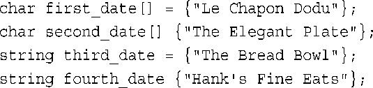

### 赋值、拼接和附加

4.3.2 赋值、拼接和附加
使用string类时，某些操作比使用数组时更简单。例如，不能将一个数组赋给另一个数组，但可以将一个string对象赋给另一个string对象：
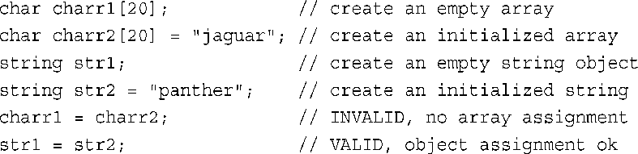

string类简化了字符串合并操作。可以使用运算符+将两个string对象合并起来，还可以使用运算符+=将字符串附加到string对象的末尾。继续前面的代码，您可以这样做：

```cpp
string str3;
str3 = str1 + str2;
```

转义序列 `\"` 表示双引号，而不是字符串结尾
```cpp
str4 = " \" i am dog \" ";
// "i am dog"
```


确定字符串中字符数的方法：
```
str4.size();
```

### string类I/O

正如您知道的，可以使用cin和运算符<<来将输入存储到string对象中，使用cout和运算符<<来显示string对象，其句法与处理C-风格字符串相同。但每次==读取一行==而不是一个单词时，使用的句法不同，

```cpp
cin.getline(charr,20);//charr 为数组
getline(cin,str); // str为string对象
```

为何一个getline( )是istream的类方法，而另一个不是呢？在引入string类之前很久，C++就有istream类。因此istream的设计考虑到了诸如double和int等基本C++数据类型，但没有考虑string类型，所以istream类中，有处理double、int和其他基本类型的类方法，但没有处理string对象的类方法。

### 其他形式的字符串字面值

本书前面说过，除char类型外，C++还有类型wchar_t；而C++11新增了类型char16_t和char32_t。可创建这些类型的数组和这些类型的字符串字面值。
对于这些类型的字符串字面值，C++分别使用前缀`L`、`u`和`U`表示，下面是一个如何使用这些前缀的例子：

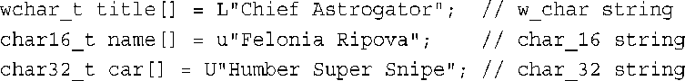

**UTF8**
C++11还支持Unicode字符编码方案UTF-8。在这种方案中，根据编码的数字值，字符可能存储为1～4个八位组。C++使用前缀`u8`来表示这种类型的字符串字面值。


**原始字符串**
C++11新增的另一种类型是原始（raw）字符串。在原始字符串中，字符表示的就是自己，例如，序列\n不表示换行符，而表示两个常规字符—斜杠和n，因此在屏幕上显示时，将显示这两个字符。

原始字符串将 `"(` 和 `)"` 用作定界符，并使用前缀R来标识原始字符串：
```cpp
cout << R"(Jim "like" dog)" << endl;
// Jim "like" dog
```

如果要在原始字符串中包含`)"`，该如何办呢？编译器见到第一个`)"`时，会不会认为字符串到此结束？会的。但原始字符串语法允许您在表示字符串开头的`"`和`(`之间添加其他字符，这意味着表示字符串结尾的`"` 和 `)` 之间也必须包含这些字符。因此，使用 `R"+*(`  标识原始字符串的开头时，必须使用 `)+*"` 标识原始字符串的结尾。因此，下面的语句：
```cpp
cout << R"+*( "( dog )" )+*" << endl;
// "( dog )"
```

总之，这使用`"+*(`和`)+*"`替代了默认定界符`"(`和`)"`。自定义定界符时，在默认定界符之间添加任意数量的基本字符，但空格、左括号、右括号、斜杠和控制字符（如制表符和换行符）除外。

## 结构简介

假设要存储有关篮球运动员的信息，则可能需要存储他（她）的姓名、工资、身高、体重、平均得分、命中率、助攻次数等。希望有一种数据格式可以将所有这些信息存储在一个单元中。数组不能完成这项任务，因为虽然数组可以存储多个元素，但所有元素的类型必须相同。也就是说，一个数组可以存储20个int，另一个数组可以存储10个float，但同一个数组不能在一些元素中存储int，在另一些元素中存储float。

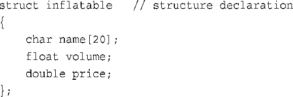

关键字struct表明，这些代码定义的是一个结构的布局。标识符inflatable是这种数据格式的名称，因此新类型的名称为inflatable。这样，便可以像创建char或int类型的变量那样创建inflatable类型的变量了。接下来的大括号中包含的是结构存储的数据类型的列表，其中每个列表项都是一条声明语句。这个例子使用了一个适合用于存储字符串的char数组、一个float和一个double。列表中的每一项都被称为结构成员，因此infatable结构有3个成员（参见图4.6）。总之，结构定义指出了新类型（这里是inflatable）的特征。

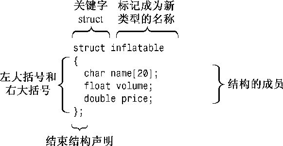

```cpp
struct inflatable{
    char name[20];
    float volume;
};

inflatable hat;
```
如果您熟悉C语言中的结构，则可能已经注意到了，C++允许在声明结构变量时省略关键字struct：

在C++中，结构标记的用法与基本类型名相同。这种变化强调的是，结构声明定义了一种新类型。在C++中，省略struct不会出错。

由于hat的类型为inflatable，因此可以使用成员运算符（.）来访问各个成员。例如，hat.volume指的是结构的volume成员，hat.price指的是price成员。同样，vincent.price是vincent变量的price成员。总之，通过成员名能够访问结构的成员，就像通过索引能够访问数组的元素一样。由于price成员被声明为double类型，因此hat.price和vincent.price相当于是double类型的变量，可以像使用常规double变量那样来使用它们。总之，hat是一个结构，而hat.price是一个double变量。顺便说一句，访问类成员函数（如cin.getline( )）的方式是从访问结构成员变量（如vincent.price）的方式衍生而来的。


### C++11结构初始化

与数组一样，C++11也支持将列表初始化用于结构，且等号（=）是可选的：
```cpp
inflatable duck {"Daphne",0.12}
```

其次，如果大括号内未包含任何东西，各个成员都将被设置为零。

最后，不允许缩窄转换。

### 结构可以将string类作为成员吗

答案是肯定的，只要您使用的编译器支持对以string对象作为成员的结构进行初始化。
```cpp
#include <string>
struct inflatable{
    std::string name;
    float volume;
};
```

### 其他结构属性

C++使用户定义的类型与内置类型尽可能相似。例如，可以将结构作为参数传递给函数，也可以让函数返回一个结构。另外，==还可以使用赋值运算符（=）将结构赋给另一个同类型的结构，这样结构中每个成员都将被设置为另一个结构中相应成员的值，即使成员是数组。这种赋值被称为成员赋值（memberwise assignment）==，将在第7章讨论函数时再介绍如何传递和返回结构。

可以==同时完成定义结构和创建结构变量==的工作。为此，只需将变量名放在结束括号的后面即可：
```cpp
struct perks{
	int key_number;
	char car[12];
}mr_smith,ms_jones;
```

甚至可以初始化以这种方式创建的变量：
```cpp
struct perks{
	int key_number;
	char car[12];
}mr_glitz = {
	7,
	"Packard"
}
```

**匿名结构体**
```cpp
struct{
	int x;
	int y;
}position;
```
这样将创建一个名为position的结构变量。可以使用成员运算符来访问它的成员（如position.x），但这种类型没有名称，因此以后无法创建这种类型的变量。本书将不使用这种形式的结构。

与C结构不同，C++结构除了成员变量之外，还可以有成员函数。但这些高级特性通常被用于类中，而不是结构中，因此将在讨论类的时候（从第10章开始）介绍它们。

### 结构数组

inflatable结构包含一个数组（name）。也可以创建元素为结构的数组，方法和创建基本类型数组完全相同。例如，要创建一个包含100个inflatable结构的数组，可以这样做：
```cpp
inflatable gifts[100];
```

这样，gifts将是一个inflatable数组，其中的每个元素（如gifts[0]或gifts[99]）都是inflatable对象，可以与成员运算符一起使用：
```cpp
cin >> gifts[0].volume;
cout << gifts[99].price << endl;
```

初始化结构数组，可以结合使用初始化数组的规则（用逗号分隔每个元素的值，并将这些值用花括号括起）和初始化结构的规则（用逗号分隔每个成员的值，并将这些值用花括号括起）。由于数组中的每个元素都是结构，因此可以使用结构初始化的方式来提供它的值。因此，最终结果为一个被括在花括号中、用逗号分隔的值列表，其中每个值本身又是一个被括在花括号中、用逗号分隔的值列表：

```cpp
#include <iostream>
using namespace std;
struct inflatable{
    char name[20];
    float volume;
    double price;
};
int main(){
    inflatable guests[2] = {
        {"Bambi",0.5,21.99},
        {"Godzilla",2000,565.99}
    };
    cout << guests[0].name << endl;
    return 0;
};
```

### 结构中的位字段

与C语言一样，C++也允许指定占用特定位数的结构成员，这使得创建与某个硬件设备上的寄存器对应的数据结构非常方便。字段的类型应为整型或枚举（稍后将介绍），接下来是冒号，冒号后面是一个数字，它指定了使用的位数。可以使用没有名称的字段来提供间距。每个成员都被称为位字段（bit field）。

```cpp
struct torgle_register{
    unsigned int SN :4;
    unsigned int :4;
    bool goodIn :1;
    bool gooodTorgle :1;
};
```

可以像通常那样初始化这些字段，还可以使用标准的结构表示法来访问位字段：

```cpp
torgle_register tr = {14,true,false};
if (tr.goodIn)
```

## 共用体

共用体（union）是一种数据格式，它能够存储不同的数据类型，但只能同时存储其中的一种类型。

```cpp
union one4all{
	int int_val;
	long long_val;
	double double_val;
}
```

```cpp
one4all pail;
cin >> pail.one_val;
```

```cpp
struct widget{
	char brand[20];
	int type;
	union id{
		long id_num;
		char id_char[20];
	}id_val;
};
widget prize;
...
if(widget.type == 1)
```

**匿名共用体（anonymous union）**
没有名称，其成员将成为位于相同地址处的变量。显然，每次只有一个成员是当前的成员：

```cpp
struct widget{
	char brand[20];
	int type;
	union{
		long id_num;
		char id_char[20];
	};
};
...
widget prize;
...
if(prize.type==1)
	cin >> prize.id_num;
else
	cin >> prize.id_char;
```

## 枚举

```cpp
enum spectrum {red,orange,yello,green,blue,violet,indigo,ultraviolet}
```

这条语句完成两项工作。
让spectrum成为新类型的名称；spectrum被称为枚举（enumeration），就像struct变量被称为结构一样。
将red、orange、yellow等作为符号常量，它们对应整数值0～7。这些常量叫作枚举量（enumerator）。

在默认情况下，将整数值赋给枚举量，第一个枚举量的值为0，第二个枚举量的值为1，依次类推。可以通过显式地指定整数值来覆盖默认值，本章后面将介绍如何做。
可以用枚举名来声明这种类型的变量：
```cpp
spectrum band;
```

枚举变量具有一些特殊的属性，下面来看一看。
==在不进行强制类型转换的情况下，只能将定义枚举时使用的枚举量赋给这种枚举的变量，如下所示：==
```cpp
band = blue;
band = 2000; // invalid
```

对于枚举，只定义了赋值运算符。具体地说，没有为枚举定义算术运算：
```cpp
brand = orange;
++brand;// invalid
band = orange + red; // invalid
```


如果打算只使用常量，而不创建枚举类型的变量，则可以省略枚举类型的名称，如下面的例子所示：
```cpp
enum {green,red,yello};
```


### 设置枚举量的值

可以使用赋值运算符来显式地设置枚举量的值：
```cpp
enum bits{one=1, two=2, four=4};
```

只显式地定义其中一些枚举量的值：
```cpp
enum bigstep{ first,second= 100, third };
```
这里，first在默认情况下为0。后面没有被初始化的枚举量的值将比其前面的枚举量大1。因此，third的值为101。

最后，可以创建多个值相同的枚举量：
```cpp
enum {zero, null=0, one, numero_uno=1};
```

### 枚举的取值范围

C++现在通过强制类型转换，增加了可赋给枚举变量的合法值。每个枚举都有取值范围（range），通过强制类型转换，可以将取值范围中的任何整数值赋给枚举变量，即使这个值不是枚举值。例如，假设bits和myflag的定义如下：
```cpp
enum bits{one=1,two=2,four=4,eight=8};
bits myflag;
```

则下面的代码将是合法的：
```
myflag = bits(6);
```

其中6不是枚举值，但它位于枚举定义的取值范围内。
取值范围的定义如下。首先，要找出上限，需要知道枚举量的最大值。找到大于这个最大值的、最小的2的幂，将它减去1，得到的便是取值范围的上限。例如，前面定义的bigstep的最大值枚举值是101。在2的幂中，比这个数大的最小值为128，因此取值范围的上限为127。要计算下限，需要知道枚举量的最小值。如果它不小于0，则取值范围的下限为0；否则，采用与寻找上限方式相同的方式，但加上负号。例如，如果最小的枚举量为−6，而比它小的、最大的2的幂是−8（加上负号），因此下限为−7。

C++11扩展了枚举，增加了作用域内枚举（scoped enumeration），第10章的“类作用域”一节将简要地介绍这种枚举。

## 指针和自由存储空间

只需对变量应用地址运算符（&），就可以获得它的位置；
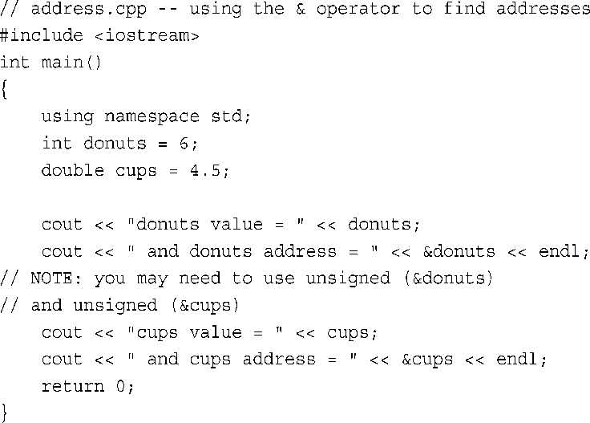

下面是该程序在某个系统上的输出：
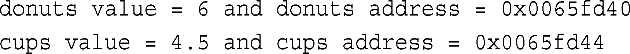

显示地址时，该实现的cout使用十六进制表示法，因为这是常用于描述内存的表示法（有些实现可能使用十进制表示法）。在该实现中，donuts的存储位置比cups要低。两个地址的差为0x0065fd44 – 0x0065fd40（即4）。这是有意义的，因为donuts的类型为int，而这种类型使用4个字节。当然，不同系统给定的地址值可能不同。有些系统可能先存储cups，再存储donuts，这样两个地址值的差将为8个字节，因为cups的类型为double。另外，在有些系统中，可能不会将这两个变量存储在相邻的内存单元中。

使用常规变量时，值是指定的量，而地址为派生量。下面来看看指针策略，它是C++内存管理编程理念的核心（参见旁注“指针与C++基本原理”）。
```markdown
# 指针与C++基本原理
面向对象编程与传统的过程性编程的区别在于，OOP强调的是在运行阶段（而不是编译阶段）进行决策。运行阶段指的是程序正在运行时，编译阶段指的是编译器将程序组合起来时。运行阶段决策就好比度假时，选择参观哪些景点取决于天气和当时的心情；而编译阶段决策更像不管在什么条件下，都坚持预先设定的日程安排。
运行阶段决策提供了灵活性，可以根据当时的情况进行调整。例如，考虑为数组分配内存的情况。传统的方法是声明一个数组。要在C++中声明数组，必须指定数组的长度。因此，数组长度在程序编译时就设定好了；这就是编译阶段决策。您可能认为，在80%的情况下，一个包含20个元素的数组足够了，但程序有时需要处理200个元素。为了安全起见，使用了一个包含200个元素的数组。这样，程序在大多数情况下都浪费了内存。OOP通过将这样的决策推迟到运行阶段进行，使程序更灵活。在程序运行后，可以这次告诉它只需要20个元素，而还可以下次告诉它需要205个元素。
总之，使用OOP时，您可能在运行阶段确定数组的长度。为使用这种方法，语言必须允许在程序运行时创建数组。稍后您看会到，C++采用的方法是，使用关键字new请求正确数量的内存以及使用指针来跟踪新分配的内存的位置。
在运行阶段做决策并非OOP独有的，但使用C++编写这样的代码比使用C语言简单。
```

### 源码和数字

指针不是整型，虽然计算机通常把地址当作整数来处理。从概念上看，指针与整数是截然不同的类型。整数是可以执行加、减、除等运算的数字，而指针描述的是位置，将两个地址相乘没有任何意义。从可以对整数和指针执行的操作上看，它们也是彼此不同的。因此，不能简单地将整数赋给指针：
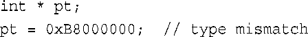

在这里，左边是指向int的指针，因此可以把它赋给地址，但右边是一个整数。您可能知道，0xB8000000是老式计算机系统中视频内存的组合段偏移地址，但这条语句并没有告诉程序，这个数字就是一个地址。在C99标准发布之前，C语言允许这样赋值。但C++在类型一致方面的要求更严格，编译器将显示一条错误消息，通告类型不匹配。要将数字值作为地址来使用，应通过强制类型转换将数字转换为适当的地址类型：
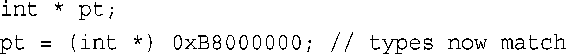

### 使用new来分配内存

在运行阶段为一个int值分配未命名的内存，并使用指针来访问这个值。这里的关键所在是C++的new运算符。程序员要告诉new，需要为哪种数据类型分配内存；new将找到一个长度正确的内存块，并返回该内存块的地址。程序员的责任是将该地址赋给一个指针。下面是一个这样的示例：

```cpp
int *pn = new int;
```

new int告诉程序，需要适合存储int的内存。new运算符根据类型来确定需要多少字节的内存。然后，它找到这样的内存，并返回其地址。接下来，将地址赋给pn，pn是被声明为指向int的指针。现在，pn是地址，而`*pn`是存储在那里的值。将这种方法与将变量的地址赋给指针进行比较：

```cpp
int higgens;
int *pt = &higgens;
```

在这两种情况（pn和pt）下，都是将一个int变量的地址赋给了指针。在第二种情况下，可以通过名称higgens来访问该int，在第一种情况下，则只能通过该指针进行访问。这引出了一个问题：pn指向的内存没有名称，如何称呼它呢？我们说pn指向一个==数据对象==，这里的“对象”不是“面向对象编程”中的对象，而是一样“东西”。术语“数据对象”比“变量”更通用，它指的是为数据项分配的内存块。因此，变量也是数据对象，但pn指向的内存不是变量。乍一看，处理数据对象的指针方法可能不太好用，但它使程序在管理内存方面有更大的控制权。

为一个数据对象（可以是结构，也可以是基本类型）获得并指定分配内存的通用格式如下：
```cpp
typeName *pointer_name = new typeName;
```

需要在两个地方指定数据类型：用来指定需要什么样的内存和用来声明合适的指针。当然，如果已经声明了相应类型的指针，则可以使用该指针，而不用再声明一个新的指针。程序清单4.17演示了如何将new用于两种不同的类型。
程序清单4.17 use_new.cpp
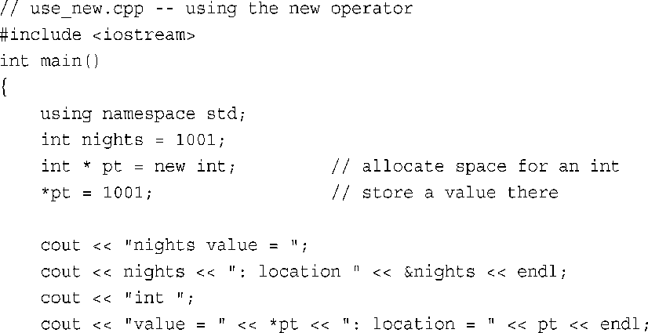
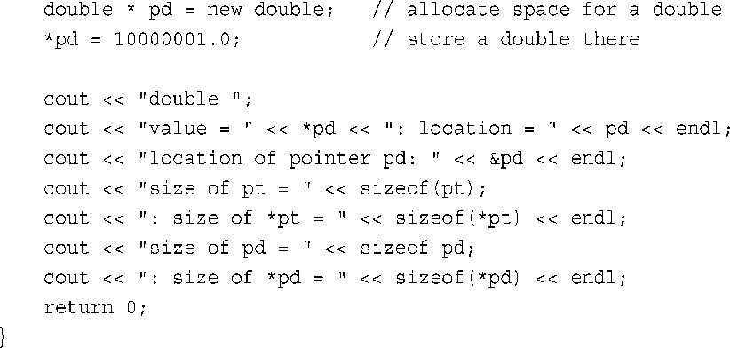

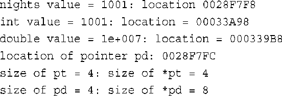

对于指针，需要指出的另一点是，new分配的内存块通常与常规变量声明分配的内存块不同。变量nights和pd的值都存储在被称为栈（stack）的内存区域中，而new从被称为堆（heap）或自由存储区（free store）的内存区域分配内存。

> [!info] 内存被耗尽？
> 计算机可能会由于没有足够的内存而无法满足new的请求。在这种情况下，new通常会引发异常—一种将在第15章讨论的错误处理技术；而在较老的实现中，new将返回0。在C++中，值为0的指针被称为空指针（null pointer）。C++确保空指针不会指向有效的数据，因此它常被用来表示运算符或函数失败（如果成功，它们将返回一个有用的指针）。将在第6章讨论的if语句可帮助您处理这种问题；就目前而言，您只需如下要点：C++提供了检测并处理内存分配失败的工具。

### 使用delete释放内存

当需要内存时，可以使用new来请求，这只是C++内存管理数据包中有魅力的一个方面。另一个方面是delete运算符，它使得在使用完内存后，能够将其归还给内存池，这是通向最有效地使用内存的关键一步。归还或释放（free）的内存可供程序的其他部分使用。使用delete时，后面要加上指向内存块的指针（这些内存块最初是用new分配的）

```cpp
int *ps = new int;
...
delete ps;
```

这将释放ps指向的内存，但不会删除指针ps本身。例如，可以将ps重新指向另一个新分配的内存块。一定要配对地使用new和delete；否则将发生内存泄漏（memory leak），也就是说，被分配的内存再也无法使用了。如果内存泄漏严重，则程序将由于不断寻找更多内存而终止。
不要尝试释放已经释放的内存块，C++标准指出，这样做的结果将是不确定的，这意味着什么情况都可能发生。另外，不能使用delete来释放声明变量所获得的内存：
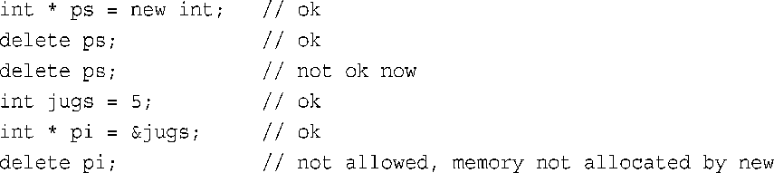

> 只能用delete来释放使用new分配的内存。然而，对空指针使用delete是安全的。


### 使用new来创建动态数组

**1. 使用new来创建动态数组**

```cpp
int *psome = new int [10];
```

new运算符返回第一个元素的地址。

当程序使用完new分配的内存块时，应使用delete释放它们。然而，对于使用new创建的数组，应使用另一种格式的delete来释放：
```cpp
delete [] psome
```

方括号告诉程序，应释放整个数组，而不仅仅是指针指向的元素。请注意delete和指针之间的方括号。如果使用new时，不带方括号，则使用delete时，也不应带方括号。如果使用new时带方括号，则使用delete时也应带方括号。C++的早期版本无法识别方括号表示法。然而，对于ANSI/ISO标准来说，new与delete的格式不匹配导致的后果是不确定的，这意味着程序员不能依赖于某种特定的行为。下面是一个例子：

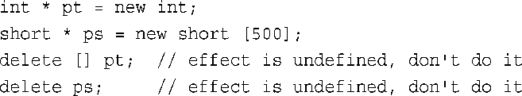


一般来说，如果给cout提供一个指针，它将打印地址。但如果指针的类型为`char *`，则cout将显示指向的字符串。如果要显示的是字符串的地址，则必须将这种指针强制转换为另一种指针类型，如`int *`（上面的代码就是这样做的）。因此，ps显示为字符串“fox”，而`（int *）`ps显示为该字符串的地址。

首先，需要分配内存来存储该字符串，这可以通过声明另一个数组或使用new来完成。后一种方法使得能够根据字符串的长度来指定所需的空间：
```cpp
ps = new char[strlen(animal)+1];
```


### 使用new创建动态结构

将new用于结构由两步组成：创建结构和访问其成员。要创建结构，需要同时使用结构类型和new。例如，要创建一个未命名的inflatable类型，并将其地址赋给一个指针，可以这样做：

```cpp
inflatable * ps = new inflatable;
```

这将把足以存储inflatable结构的一块可用内存的地址赋给ps。

箭头成员运算符（−>）。该运算符由连字符和大于号组成，可用于指向结构的指针，就像点运算符可用于结构名一样。例如，如果ps指向一个inflatable结构，则ps−>price是被指向的结构的price成员（参见图4.11）。
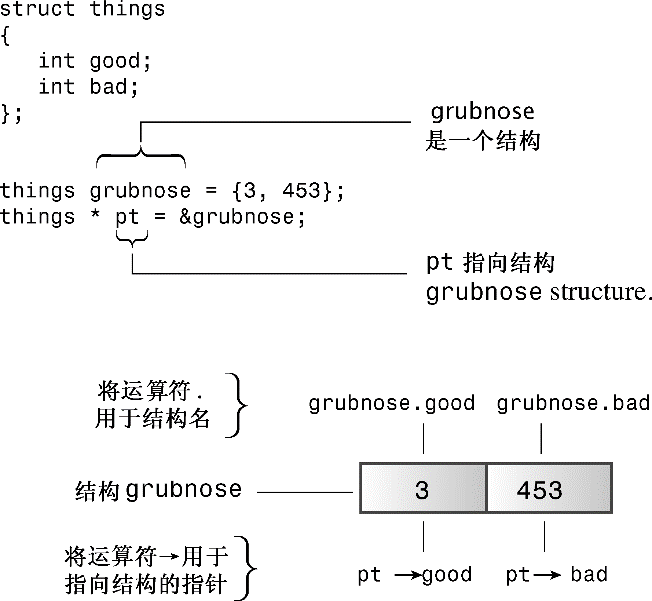

另一种访问结构成员的方法是，如果ps是指向结构的指针，则`*ps`就是被指向的值—结构本身。由于`*ps`是一个结构，因此`（*ps）.price`是该结构的price成员。C++的运算符优先规则要求使用括号。

### 自动存储、静态存储和动态存储

**1．自动存储

在函数内部定义的常规变量使用自动存储空间，被称为自动变量（automatic variable），这意味着它们在所属的函数被调用时自动产生，在该函数结束时消亡。例如，程序清单4.22中的temp数组仅当getname( )函数活动时存在。当程序控制权回到main( )时，temp使用的内存将自动被释放。如果getname( )返回temp的地址，则main( )中的name指针指向的内存将很快得到重新使用。这就是在getname( )中使用new的原因之一。

自动变量通常存储在栈中。这意味着执行代码块时，其中的变量将依次加入到栈中，而在离开代码块时，将按相反的顺序释放这些变量，这被称为后进先出（LIFO）。因此，在程序执行过程中，栈将不断地增大和缩小。

**2．静态存储**

静态存储是整个程序执行期间都存在的存储方式。使变量成为静态的方式有两种：一种是在函数外面定义它；另一种是在声明变量时使用关键字static：

```cpp
static double fee = 56.50;
```


## 10 数组的替代品

### 10.1 模板类vector

模板类vector类似于string类，也是一种动态数组。您可以在运行阶段设置vector对象的长度，可在末尾附加新数据，还可在中间插入新数据。基本上，它是使用new创建动态数组的替代品。实际上，vector类确实使用new和delete来管理内存，但这种工作是自动完成的。

首先，要使用vector对象，必须包含头文件vector。其次，vector包含在名称空间std中，因此您可使用using编译指令、using声明或std::vector。第三，模板使用不同的语法来指出它存储的数据类型。第四，vector类使用不同的语法来指定元素数。下面是一些示例：

```cpp
#include <vector>
...
using namespace std;
vector<int> vi; // 创建一个长度为0的int数组
int n;
cin >> n;
vector<double> vd(n) ; // creact an array
```

vector对象在您插入或添加值时自动调整长度，因此可以将vi的初始长度设置为零。但要调整长度，需要使用vector包中的各种方法。

一般而言，下面的声明创建一个名为vt的vector对象，它可存储n_elem个类型为typeName的元素：
```cpp
vector<typeName> vt(n_elem);
```

其中参数`n_elem`可以是整形常量，也可以是整形变量

### 10.2 模板类array（C++11）

vector类的功能比数组强大，但付出的代价是效率稍低。如果您需要的是长度固定的数组，使用数组是更佳的选择，但代价是不那么方便和安全。有鉴于此，C++11新增了模板类array，它也位于名称空间std中。与数组一样，array对象的长度也是固定的，也使用栈（静态内存分配），而不是自由存储区，因此其效率与数组相同，但更方便，更安全。

```cpp
#include <array>
...
using namespace std;
array<int,5> ai; // 创建长度为5的int数组
array<double,4> ad = {1.2,2.1,3.43,4.3};
```

推而广之，下面的声明创建一个名为arr的array对象，它包含n_elem个类型为typename的元素：

```
array<typeName, n_elem> arr;
```

与创建vector对象不同的是，n_elem不能是变量

> 在C++11中，可将列表初始化用于vector和array对象，但在C++98中，不能对vector对象这样做。

### 10.3 比较数组、vector对象和array对象

数组中
```cpp
a1[-2] = 20.2
```
其含义如下：找到a1指向的地方，向前移两个double元素，并将20.2存储到目的地。也就是说，将信息存储到数组的外面。与C语言一样，C++也不检查这种超界错误。在这个示例中，这个位置位于array对象a3中。其他编译器可能将20.2放在a4中，甚至做出更糟糕的选择。这表明数组的行为是不安全的。

一种选择是使用成员函数at()。就像可以使用cin对象的成员函数getline()一样，您也可以使用vector和array对象的成员函数at()：
```cpp
a2.at(1) = 2.3;
```

中括号表示法和成员函数at()的差别在于，使用at()时，将在运行期间捕获非法索引，而程序默认将中断。这种额外检查的代价是运行时间更长

C++98新增的标准模板库（STL）提供了模板类vector，它是动态数组的替代品。C++11提供了模板类array，它是定长数组的替代品

