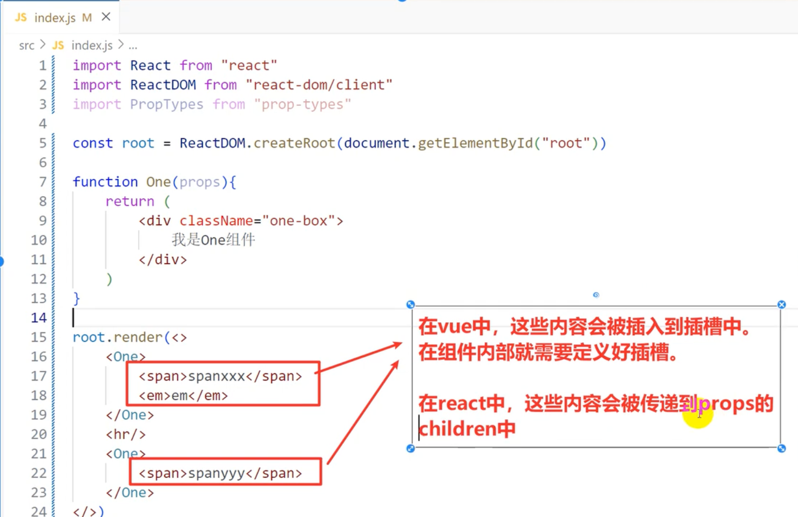
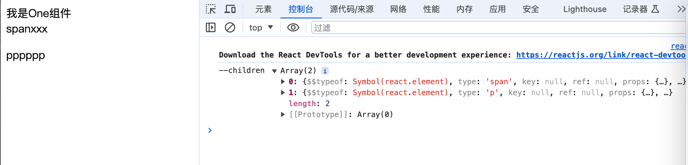
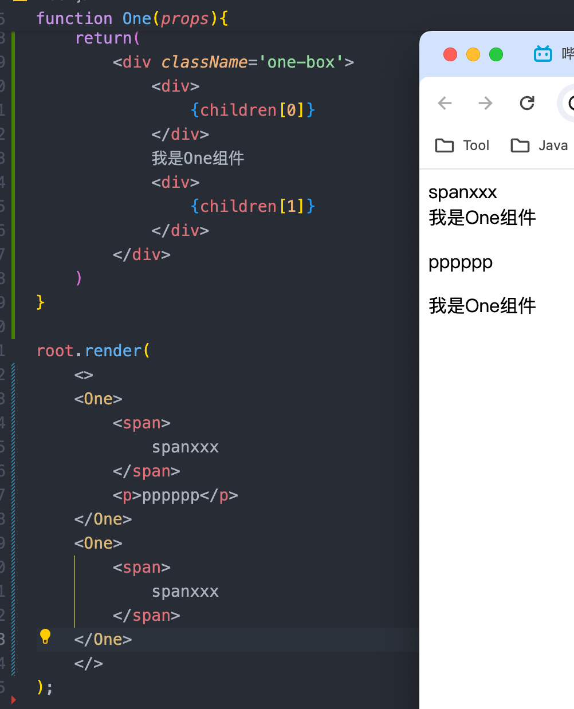
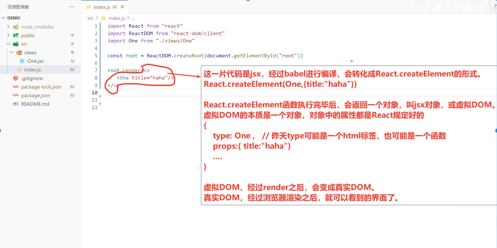
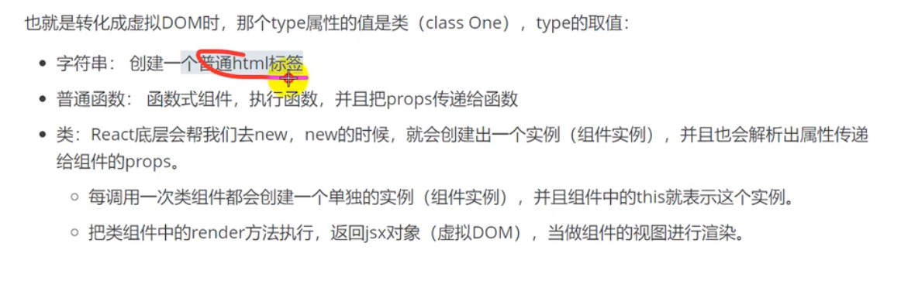
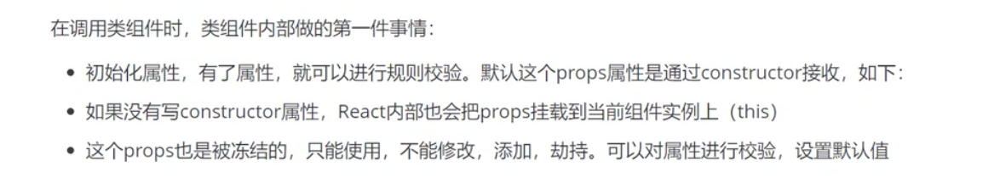

# React-18

[官方文档](https://react.xiniushu.com/docs/getting-started.html)

[视频教程](https://www.bilibili.com/video/BV1Rj421o7QF)

# 一、介绍

## 项目创建

脚手架创建

```
npx create-react-app
//或者
pnpx create-react-app .
// ts
pnpx create-react-app <my-app> --template typescript
```

cdn创建

```jsx
   <div id="app"></div>
	<!-- 引入react核心库 -->
	<script type="text/javascript" src="../js/react.development.js"></script>
	<!-- 引入react-dom，用于支持react操作DOM -->
	<script type="text/javascript" src="../js/react-dom.development.js"></script>
	<!-- 引入babel，用于将jsx转为js -->
	<script type="text/javascript" src="../js/babel.min.js"></script>
	<script type="text/babel">
		const demo = <span>Hello Word</span>
		ReactDOM.render(demo, document.querySelector('#app'));
	</script>

```

## 使用CDN

在 html 代码中导入框架代码：

```
<script crossorigin src="<https://unpkg.com/react@18/umd/react.development.js>"></script>
<script crossorigin src="<https://unpkg.com/react-dom@18/umd/react-dom.development.js>"></script>

```

这两个文件说明：

1. react.development.js 是提供 api；
2. react-dom.development.js 是提供操作浏览器 dom 的 api；
3. 在浏览器中暴露的对象为：React 和 ReactDOM；

由于我们在使用 react 创建的组件进行渲染的时候使用的是 jsx 语法，浏览器没法识别该语法，那么就需要引入 babel 组件进行编译 jsx 语法，然后浏览器能够识别；

```
<script src='<https://unpkg.com/babel-standalone@6.26.0/babel.js>'></script>

```

我们需要告诉浏览器那些代码块是需要 babel 编译的代码，需要在如下内容体内写 react 代码：`<script type='text/babel'></script>`

用例如下：

1. 首先在 script 块中添加组件：`var html1=<h1>hello world!!</h1>;`
2. 在通过 ReactDOM.render(param1,param2) 进行渲染，该 api 的两个参数：第一个参数是传入组件也就是上面的 html1，第二个参数就是渲染到哪里的选择定位器，我们通过 docment.getElementById();

完整代码如下：

```html
<!DOCTYPE html>
<html lang="en">
<head>
    <meta charset="UTF-8">
    <meta >
    <title>Document</title>
</head>
<script crossorigin src="<https://unpkg.com/react@18/umd/react.development.js>"></script>
<script crossorigin src="<https://unpkg.com/react-dom@18/umd/react-dom.development.js>"></script>
<script src='<https://unpkg.com/babel-standalone@6.26.0/babel.js>'></script>
<body>
    <div id="app"></div>
</body>
</html>
<script type="text/babel">
    var html1=<h1>hello world!!!</h1>
    ReactDOM.render(html1,document.getElementById("app"));
    // console.log(React);
    // console.log(ReactDOM);
</script>
```

## React.createElement()认识

`React.createElement()` 是 jsx 编译后的 react 代码结果，该 api 是创建一个元素

将如上代码使用该 api 替换，如下：

```jsx
<!DOCTYPE html>
<html lang="en">
<head>
    <meta charset="UTF-8"/>
    <title>Document</title>
</head>
<script crossorigin src="<https://unpkg.com/react@18/umd/react.development.js>"></script>
<script crossorigin src="<https://unpkg.com/react-dom@18/umd/react-dom.development.js>"></script>
<script src='<https://unpkg.com/babel-standalone@6.26.0/babel.js>'></script>
<body>
    <div id="app"></div>
</body>
</html>
<script type="text/babel">
    // var html1=<h1>hello world!!!</h1>
    var html1 = React.createElement("h1",null,"hello world");
    ReactDOM.render(html1,document.getElementById("app"));
    // console.log(React);
    // console.log(ReactDOM);
</script>
```

# 二、JSX

## JSX语法

1. 渲染定义的元素，表达式需要 `{ }`

```
const name = 'Hello Word'
<span style={{color:'red',fontSize:'55px'}}>{name}</span>

```

1. 样式的类名，要用 `className`。

```
<div className={"classname"} id={ID}>
</div>

```
<span v-pre>
1. 内联样式，要用 <code v-pre>style={{key:value}}</code>`的形式去写。
</span>

```
<span style={{color:'red',fontSize:'55px'}}>{name}</span>
```

1. 只有一个根标签
2. 标签必须闭合
3. `undefined`/`null`/`Boolean` 类型

```
 <h2>{String(aaa)}</h2>
 <h2>{bbb + ""}</h2>
 <h2>{ccc.toString()}</h2>

```

1. 使用引号传递字符串

```jsx
{'this is message'}

```

### 变量与函数

```jsx
const count =100
function getName (){
  return 'jock'
}
function App() {
  return (
    <div className="App">
      this is App
      {/* 使用引号传递字符串 */}
      {'this is div'}
      {/* 识别js变量 */}
      {count}
      {/* 函数调用 */}
      {getName()}
      {/* 方法调用 */}
      {new Date().getDate()}
      {/* 使用js对象 */}
      <div style={{ color:'red' }}>this is div</div>
    </div>
  );
}

```

### 数组渲染

渲染列表

```jsx
// 项目的根组件
// App -> index.js -> public/index.html(root)
const count =100
const list =[
  { id:1001, name:'vue'},
  { id:1002, name: 'React'},
  { id:1003, name: 'Angular'}
]
function App() {
  return (
    <div className="App">
      {/* 渲染列表 */}
      <ul>
        {list.map(item => <li>Vue</li>)}
        {list.map(item => <li key={item.id}>{item.name}</li>)}
      </ul>
    </div>
  );
}

```

### 样式

行内样式

```
{/* 行内样式，样式要放到对象中 ,基于对象格式处理的*/}
<div style={ { color: "red" } }></div>

```

`class` 属性 要用 `className`

```jsx
{/* 行内样式，样式要放到对象中 ,基于对象格式处理的*/}
<div className="namecla"></div>

```

通过样式控制是否显示

```
{/* 通过样式控制是否显示 */}
<button style={{display: flag?'block':'none'}}>登录</button>

```

### 三元运算符

```jsx
const isLogin =true

{/* 逻辑与 && */}
{isLogin && <span>this is span</span>}
{/* 三元运算符 */}
{isLogin ? <span>jack</span>:<span>ligin</span>}

```

### 事件绑定

```
on + 事件名称 = { 事件处理程序 }

```

使用事件对象参数

```jsx
function App() {
  const handleClick = (e)=>{//设置形参e
    console.log("button背电极了",e)
  }
  return (
    <div className="App">
      <button onClick={handleClick}>Click me</button>
    </div>
  );
}

```

> 使用 箭头函数保留了上下文，调用时会到App中寻找handleClick

传递自定义参数

```jsx
function App() {
  const handleClick = (name)=>{//设置形参e
    console.log(name)
  }
  return (
    <div className="App">
      <button
      onClick={handleClick("jack")}
      >
      >Click me</button>
    </div>
  );
}

```

传递 自定义参数 与 事件对象参数

```jsx
function App() {
  const handleClick = (none,e)=>{//设置形参e
    console.log(none,e)
  }
  return (
    <div className="App">
      <button onClick={(e)=>{handleClick("jack",e)}}>Click me</button>
    </div>
  );
}
```

## JSX渲染机制

```jsx
var html1=<h1>hello world!!!</h1>
ReactDOM.render(html1,document.getElementById("app"));
```

虚拟DOM就是框架内部构建的一套对象体系

对象是属性的无序集合。这个对象中的属性都是React官方规定的

1. JSX语法编译成虚拟DOM
   1. 基于 `babel`把JSX编译成 `React.createElement()` 这种格式的JS代码
   2. 执行 `createElement()` 创建虚拟DOM对象
2. 将构建出来的虚拟DOM，渲染为真实DOM

第一次渲染页面直接将虚拟DOM转化为真是DOM，后期可能更新状态，还产生一个新的虚拟DOM，新旧的虚拟DOM会进行DOM-DIFF的对比，计算出差异，打PATC（两次虚拟DOM的差异），只去更新差异

```jsx
let virtualDom = {
	$$typeof:Symbol(react.element)
	ref: null
	key: null
	type: "div" //标签名或组件名，当要渲染的只是简单元素
	props: { 存储元素相关的属性
		className: "box" //标签属性
		children: 子节点信息，如果没有子节点，则没有这个属性，属性值可能是一个值，也可能是一个数组
	}
}
```

## 手动编译JSX文件

手动（babel）编译 jsx 文件

编译 jsx 文件，我们使用 babel cli 脚手架

babel 的官方网站：[Babel 中文文档 | Babel 中文网 · Babel 中文文档 | Babel 中文网](https://www.babeljs.cn/)

babel 的练习

1. 创建一个项目文件夹，命名随意，例如：babel-cli-demo
2. 进入目录创建一个文件名为：.babelrc.json 的文件；
3. 然后初始化项目：通过文件管理器进入文件夹，然后在路径上输入 cmd 进入 dos 命令，输入 npm init -y 或者直接使用 cscode 编辑器等代码编辑器打开项目文件夹，然后进入终端输入 npm init -y 初始化项目后会生成一个 package.json 的文件，该文件主要用于记录项目的信息，例如 java 的 maven 项目的 pom 文件；
4. 安装相关的编译工具依赖，在第三步进入的终端输入安装命令：npm install --save-dev @babel/cli @babel/core @babel/preset-react 或者 npm install -s @babel/cli @babel/core @babel/preset-react 两者等价只是后者是前者的缩写；
5. 在. babelrc.json 文件中添加如下代码告诉编译器，该项目是 react 语言；
6. 

```
    {
            "presets":["@babel/preset-react"]
    }

```

完成好以上步骤后就可以进行测试了：

在项目目录中创建一个 src 的文件夹，然后随便创建一个文件名为 a.js 的文件，文件内容：

```
<div id='aa' class='kk'>
    hello world!
</div>

```

然后使用 babel 工具进行编译 a.js 文件。在终端输入：npx babel src/a.js -o src/b.js，这个时候就 能在 src 目录下看到编译后的 b.js 文件了，文件内容如下：

```
/*#__PURE__*/React.createElement("div", {
  id: "aa",
  class: "kk"
}, "hello world!");
```

如上就是通过 babel 编译工具将 jsx 语法编译成 react 的语法；

# 三、组件

在React中，组件分两类：

- 函数式组件，也叫静态组件
- 类组件，也叫动态组件
- 

## 无状态组件（函数式组件）

React中，一个组件就是**首字母大写的函数**，内部存放了组件的视图和逻辑，渲染组件只需要把组件当成标签书写即可

要求

- 组件名首字母大写，一般使用大驼峰命名
- 还需要返回一个jsx，jsx可以使用()包裹起来

`Bilibili.jsx`

```jsx
// 1. 定义组件
function Bilibili(){
    // 组件内部逻辑
    return <button>click me</button>
}
export default Bilibili;

```

`App.jsx`

```jsx
import './App.css';
import Bilibili from './pages/Bilibili/Bilibili';

function App() {
  return (
    <div className="App">
    //2. 使用组件
      <Bilibili/>
    </div>
  );
}
export default App;

```

不同文件下使用组件

```jsx
// src/One.jsx
function One(){
	return (
		<div className="one-box">
			我是One组件
		</div>
	)
}
export default One;
```

```jsx
// src/index.jsx
import One from './One.jsx'

root.render(<One/>)
```

调用组件时，可以传递各种属性

```jsx
// src/index.jsx
import One from './One.jsx'

root.render(<One
	title="我是一个标题"
	data={ [1, 2] }
	x="123"
	y={ 123 }
	style={ {color:"green",display:"relavant"} }//style要传递一个对象
/>)
```

```jsx
// src/One.jsx
function One(props){
	return (
		<div className="one-box">
			我是One组件{props.data} //使用传递的参数
		</div>
	)
}
export default One;
```

- 如果传递的不是字符串，需要使用 `{}` 包裹起来，在组件内部。就可以通过props来接收传递过来的数据了

### 函数式组件渲染机制

1. 基于babel，把JSX代码编译成 `React.createElement()` 的JS代码形式
2. `createElement()` 方法执行，创建出一个虚拟DOM
   `createElement()`执行过程：
   1. type的值不再是一个字符串，而是一个函数
   2. One函数执行
   3. 执行时，会把One组件上写的属性，传递给One函数
   4. One函数就会通过 `props`接收，函数返回DOM元素（就是虚拟DOM）
3. 最后基于 `root.render` 把虚拟DOM转化成真实DOM，插入到 `#root`容器中

### 无状态

里面变量改变，不会使组件重新渲染


> 除非父组件重新调用这个函数式组件，才会重新渲染此组件
### Props 是只读的

组件无论是使用函数声明还是通过 class 声明，都绝不能修改自身的 props。

默认情况下，一个对象是可以修改属性，添加属性，删除属性

```jsx
let obj = {
    a: 1,
    b: 2
}
obj.a=100
obj.c=300
delete obj.b // 删除属性
console.log(obj);
```

#### 冻结对象

```jsx
let obj = {
    a: 1,
    b: 2
}
Object.freeze(obj) //冻结对象
console.log(Object.isFrozen(obj));//true
obj.a=100 //修改属性
obj.c=300 //添加属性
delete obj.b //删除属性，都没有使对象发生变化
console.log(obj);// 对象冻结后无法改变
```

- `Object.freeze(obj)`
- 检测是否被冻结：`Object.isFrozen(obj)`
- 特点：不能修改成员的值，不能新增成员的值，不能删除成员，不能劫持

props默认是冻结的，也就是不能修改props的值，即父组件到子组件的单向值传递

#### 密封对象

```jsx
let obj = {
    a: 1,
    b: 2
}
Object.seal(obj)
console.log(Object.isSealed(obj));//true
obj.a=100 //修改属性
obj.c=300 //添加属性
delete obj.b //删除属性
// Object.defineProperty(obj,'a',{ // 对象劫持，报错
//     get(){

//     }
// })
console.log(obj);// a:100,b:2
```

* `Object.seal(obj)`
* 检测是否被冻结: `Object.isSealed(obj)`
* 可以修改成员的值，不能删除或添加成员

#### 阻止扩展对象

```JS
let obj = {
    a:1,
    b:2
}
Object.preventExtensions(obj)
console.log(Object.isExtensible(obj))

obj.a=100 //修改属性
obj.c=100 //无法添加属性
delete obj.b //删除属性
Object.defineProperty(obj,'a',{//劫持
    get(){
        return 666;
    }
})
setTimeout(()=>{console.log(obj)})
```

* `Object.preventExtensions(obj)`
* 检测是否可以扩展: `Object.isExtensible(obj)`
* 特点：除了不能新增，其他都可以


props中的属性是只读的，只能使用，不能修改添加删除


### Props 组件传参


```js
import React from 'react';
import ReactDOM from 'react-dom/client';

const root = ReactDOM.createRoot(document.getElementById('root'));

// 2. 组件通过props接受传值
function One(props){
    console.log(props);
    let {title,age,data,className,children} = props
    return(
        <div className='one-box'>
            {title},
            {age},
            {data},
            {className},
            {children} //子节点
        </div>
    )
}

// 设置默认值
One.defaultProps={
    a:666
}

// 校验传递过的属性的类型 props-type 插件
One.propTypes = {
    title:propTypes.string, // 希望传递过来的title是sttring类型，如果不是，就报警告
    age:propTypes // isRequired 表示必传
}


root.render(
    //1. 传参
    <One title="one" age={2} data={[1,2]} className="box">
        <span>span</span> //子节点
        <em>em</em>
    </One>
);

```

### 插槽

使组件有更强的复用性



组件标签之间的html标签会被传入组件的`props.children`属性 

```js
import React from 'react';
import ReactDOM from 'react-dom/client';

const root = ReactDOM.createRoot(document.getElementById('root'));

function One(props){
    let { children } = props;
    console.log("--children",children);
    return(
        <div className='one-box'>
            我是One组件
            <div>
                {children}
            </div>
        </div>
    )
}

root.render(
    <One>
        <span>
            spanxxx
        </span>
        <p>pppppp</p>
    </One>
);
```



使用数组选择组件中内容
```JSX
import React from 'react';
import ReactDOM from 'react-dom/client';

const root = ReactDOM.createRoot(document.getElementById('root'));

function One(props){
    let { children } = props;
    console.log("--children",children);
    return(
        <div className='one-box'>
            <div>
                {children[0]}
            </div>    
            我是One组件
            <div>
                {children[1]}
            </div>
        </div>
    )
}

root.render(
    <>
    <One>
        <span>
            spanxxx
        </span>
        <p>pppppp</p>
    </One>
    </>
);
```

- 如果没有在标签之间写内容，children的值是undefined

children是对象时，不能用数组选择他


识别children是数组还是对象，显示元素
```JSX
import React from 'react';
import ReactDOM from 'react-dom/client';

const root = ReactDOM.createRoot(document.getElementById('root'));

function One(props){
    let { children } = props;
    // 都转成数组
    if(!children){
        children=[]
    }else if(!Array.isArray(children)){
        children=[children]
    }

    console.log("--children",children);
    return(
        <div className='one-box'>
            <div>
                {children[0]}
            </div>    
            我是One组件
            <div>
                {children[1]}
            </div>
        </div>
    )
}

root.render(
    <>
    <One>
        <span>
            spanxxx
        </span>
        <p>pppppp</p>
    </One>
    <One>
        <span>
            spanxxx
        </span>
    </One>
    </>
);

```

或者使用React提供的API，`children = React.Children.toArray(children)`

```TSX
import React from 'react';
import ReactDOM from 'react-dom/client';

const root = ReactDOM.createRoot(document.getElementById('root'));

function One(props){
    let { children } = props;
    // 都转成数组
    children = React.Children.toArray(children)

    console.log("--children",children);
    return(
        <div className='one-box'>
            <div>
                {children[0]}
            </div>    
            我是One组件
            <div>
                {children[1]}
            </div>
        </div>
    )
}

root.render(
    <>
    <One>
        <span>
            spanxxx
        </span>
        <p>pppppp</p>
    </One>
    <One>
        <span>
            spanxxx
        </span>
    </One>
    </>
);
```


#### 实现具名插槽

```jsx

import React from 'react';
import ReactDOM from 'react-dom/client';

const root = ReactDOM.createRoot(document.getElementById('root'));

function One(props){
    let { children } = props;
    // 都转成数组
    children = React.Children.toArray(children)
    let headerSlot = [];
    let footerSlot = [];
    let defaultSlot = [];
    children.forEach(child => {
        let { slot } = child.props
        if(slot=='header'){
            headerSlot.push(child)
        }else if(slot==''){
            footerSlot.push(child)
        }else{
            defaultSlot.push(child)
        }
    });
    return(
        <div className='one-box'>
            <div>
                {headerSlot}
            </div>    
            我是One组件
            <div>
                {footerSlot}
            </div>
            <div>
                {defaultSlot}
            </div>
        </div>
    )
}

root.render(
    <>
    <One slot="header">headerheader</One>
    <One slot="footer">footerfooter</One>
    <One>default</One>
    </>
);
```


## 类组件

React 类组件是 React 早期版本中用于构建组件的一种方式，与函数组件相比，它们提供了更多的生命周期方法和状态管理功能。以下是 React 类组件的一些主要知识点：

### 创建

1. **创建类组件**：
   - 类组件需要继承自 `React.Component` 或其他 React 组件类。
   - 在类中，你可以定义状态（state）和属性（props）。
   - render中返回JSX元素

```jsx
import React from 'react';

class MyComponent extends React.Component {
  // ...
}

export default MyComponent;
```


### 状态 State

   - 类组件内部可以使用状态（state）来保存和管理组件的私有数据。
   - 状态应该使用 `constructor` 构造函数来初始化，然后传入 `props`。记得先调用父类构造 `super(props)`
   - 状态更新应该使用 `this.setState` 方法，它会触发组件的重新渲染。

定义

```JSX
import React, {Component} from "react";

// 当去 new One类时，会自动调用constructor
// 这个类组件，不需要我们去new，React底层会帮我们去new
// 在它帮我们new时，就会调用生命周期函数constructor，并且会传递props给constructor
class One extends Component{
    // 如果写了constructor ，那么一定要调用super,然后传入props
    constructor(props){
        super(props)
        console.log("constructor...");
        this.state = {
            //在这里设置状态
            hard:0,
            easy:0
        }
    }

    // 类组件中有一个生命周期函数，叫render，函数式组件没有生命周期函数
    render(){
        //render需要返回一个jsx
        return (
            <>
                <h2>React难不难？</h2>
                <div>
                    <p>难：5人</p>
                    <p>不难：5人</p>
                </div>
                <div>
                    <button onClick={()=>{}}>{this.state.hard}</button>
                    <button onClick={()=>{}}>{this.state.easy}</button>
                </div>
            </>
        )
    }
}
```

```jsx
class MyComponent extends React.Component {
  constructor(props) {
    super(props);
    this.state = { count: 0 };
  }

  handleClick = () => {
    this.setState({ count: this.state.count + 1 });
  }

  render() {
    return (
      <div>
        <p>You clicked {this.state.count} times</p>
        <button onClick={this.handleClick}>Click me</button>
      </div>
    );
  }
}
```


修改

`this.setState()` 修改状态并更新视图
```TSX
import React, {Component, ReactNode} from "react";

//定义属性类型
type Props={
    title?: string
}

// 泛型 <p,s> p:传入的属性类型,s:state状态的类型
class One extends Component<Props, {easy:number,hard:number}> {
    
    // 
    static defaultProps = {
        title : '这是默认值'
    }

    // Props:props的类型校验
    constructor(props:Props){
        super(props)
        let { title } = props;
        // 定义状态 state在父类已声明，直接赋值初始化就行
        this.state={
            easy:1,
            hard:2
        }
    }
    render(){
        return(
            <>
                <button onClick={()=>{

                    // setState将传入的state对象作为新对象替换原有state，并更新虚拟DOM
                    this.setState({

                    // ts中
                        // easy:this.state.easy++,// state是只读的，不能通过改变原state对象的属性值来获取新对象
                        easy:this.state.easy+1,

                    // js中 可以修改原对象使其作为新对象传入state
                        // easy:this.state.easy++  不会变化，传入后值才变
                        // easy: ++this.state.hard 会变化，值变后传入
                    })
                }}>简单：{this.state.easy}</button>
                <button 
                >难：{this.state.hard}</button>
            </>
        )
    }
}

export default One;
```

使用`this.forceUpdata()`  强制重新渲染，跳过了react生命周期。不推荐

```TSX
import React, {Component, ReactNode} from "react";

//定义属性类型
type Props={
    title?: string
}

// 泛型 <p,s> p:传入的属性类型,s:state状态的类型
class One extends Component<Props, {easy?:number,hard?:number}> {
    
    // 
    static defaultProps = {
        title : '这是默认值'
    }

    // Props:props的类型校验
    constructor(props:Props){
        super(props)
        let { title } = props;
        // 定义状态 state在父类已声明，直接赋值初始化就行
        this.state={
            easy:1,
            hard:2
        }
    }
    render(){
        return(
            <>
                <button onClick={()=>{
                    // 直接传入新state，不引起重新渲染
                    this.state={
                        easy:1
                    }
                    // 强制重新渲染
                    this.forceUpdate()
                }}>简单：{this.state.easy}</button>
                <button 
                >难：{this.state.hard}</button>
            </>
        )
    }
}

export default One;
```

### 渲染机制







### React Props

state 和 props 主要的区别在于 props 是不可变的，而 state 可以根据与用户交互来改变。这就是为什么有些容器组件需要定义 state 来更新和修改数据。 而子组件只能通过 props 来传递数据。(react16.8后函数式子组件可以使用hook来定义state)


### 默认 Props

当 React 渲染一个组件时，它会首先检查是否有为组件提供的 props。如果没有为某个 prop 提供值，React 就会查看该组件是否定义了 defaultProps。如果定义了，React 就会从 defaultProps 中获取该 prop 的默认值，并将其与已提供的 props 合并，形成一个完整的 props 对象，然后传递给组件的实例。


```JSX
import React, {Component} from "react";

class One extends Component{

	// 定义默认值
    static defaultProps = {
        title : '这是默认值'
    }

    constructor(props){
        super(props)
        // ...
    }

    render(){
        return (
            <>
                <p>{this.props.title}</p>
            </>
        )
    }
}
```

>[!question] 用State还是Props
>

- 在组件内部可以形成闭环的状态，不管静态还是动态，用state
- 组件的外部状态，经常需要发生变化，或者定制化内容，可以考虑使用props


## 差别

> 函数式组件只根据props的变化更新视图
> 类组件则维护state和props。根据两者变化更新视图
>  函数式组件没有生命钩子


# Redux

## 1、介绍

官方文档：https://www.redux.org.cn/

先看深入浅出，再看循序渐进


# 实践
## 浏览器插件

> react development
### classnames 优化类名控制

classnames 是一个简单的JS库，通过条件动态控制class类名的显示

优化前

```jsx
<span
    key={item.type}
    onClick={()=>handleTabChange(item.type)}
    // 不直观
    className={'nav-item ${type === item.type && 'active' }'}
>
    {item.text}
</span>

```

安装
```
pnpm install classnames
```

优化后

```jsx
<div className={classNames('nav-item', {active: type === item.type})}></div>

```

```
const classNames = require('classnames');
classNames('foo','bar'); // => 'foo bar'

```

## 动态组件的实现

```jsx
import { useState } from 'react'
import style from './style.module.scss'
import A from './components/A.vue'
import B from './components/B.vue'
import C from './components/C.vue'
import D from './components/D.vue'
 
export const Index = () => {
    const [activeIndex, setActiveIndex] = useState(0)
    const switchComFn = (item: any, index: number) => {
        setActiveIndex(index)
    }
    return (<>
        <ul className={style["ul-className"]}>
            {['A', 'B', 'C', 'D'].map((item: string, index: number) => {
                return (
                    <li style={{ backgroundColor: index === activeIndex ? '#001f61b3' : '' }}
                        key={item}
                        onClick={() => switchComFn(item, index)}>
                        {item}</li>
                )
            })}
        </ul>
        <div className={style["div-className"]}>
            {activeIndex === 0 ? <A /> : null}
            {activeIndex === 1 ? <B /> : null}
            {activeIndex === 2 ? <C /> : null}
            {activeIndex === 3 ? <D /> : null}
        </div>
    </>)
}
```

## 动态组件及子组件调用父组件方法（TS）

子组件

```jsx
// 1.子组件定义传参类型
export interface ChildComponentProps{
  changeForm : (value:number) => void
}

export default  function LoginForm(props:ChildComponentProps) {

	//2. 使用props调用父组件传进的方法
	const goToRegister=()=>{
    props.changeForm(1)//点后的属性名即父组件传给标签的哪个属性
  }
  
	return <a href="#" onClick={goToRegister}>忘记密码<a/>
}
```

父组件

```jsx
// 1. 定义方法
const changeForm = (value:number) => setFormIndex(value)
// 2. 将方法传入属性
{ formIndex == 0 ? <LoginForm changeForm={changeForm} /> : null }
```

