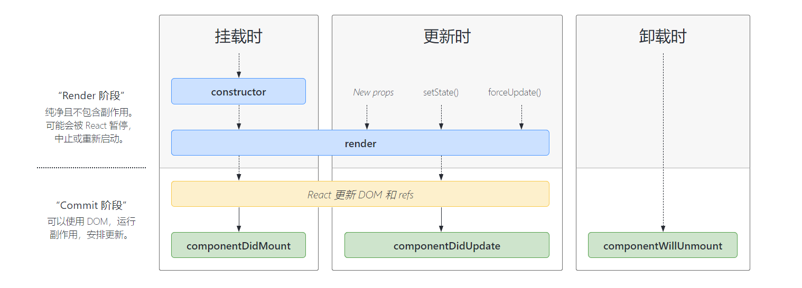
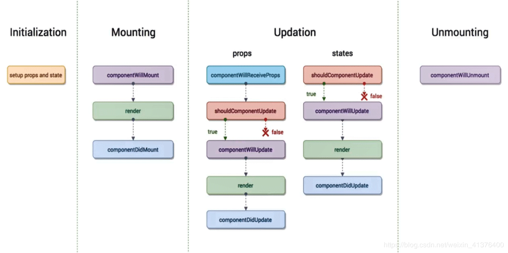
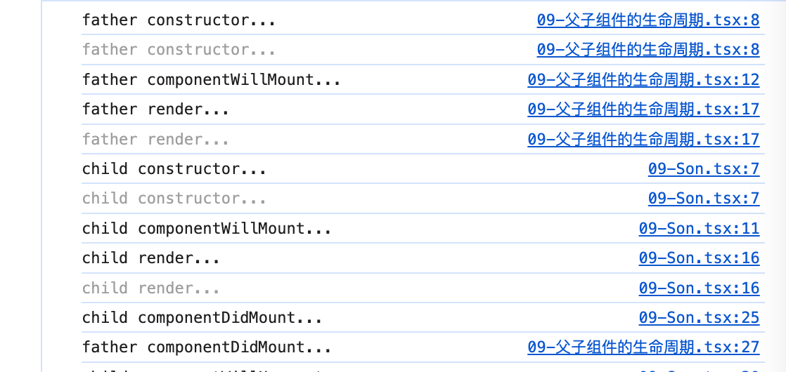

一、React 生命周期
------------

React 生命周期分为三种状态

*   1. 初始化
*   2. 更新
*   3. 销毁


### 初始化

**0、constructer()**

> 构造方法

**1、getDefaultProps()**

> 设置默认的 props，也可以用 dufaultProps 设置组件的默认属性.

**2、getInitialState()**

> 在使用 es6 的 class 语法时是没有这个钩子函数的，可以直接在 constructor 中定义 this.state。此时可以访问 this.props

**3、componentWillMount()**

> 组件初始化时只调用，以后组件更新不调用，整个生命周期只调用一次，此时可以修改 state。
> 
> 在渲染前调用, 在客户端也在服务端。

**4、 render()**

> react 最重要的步骤，创建虚拟 dom，进行 diff 算法，更新 dom 树都在此进行。此时就不能更改 state 了。

**5、componentDidMount()**

> 组件渲染之后调用，只调用一次。
> 
> 在第一次渲染后调用，只在客户端。之后组件已经生成了对应的 DOM 结构，可以通过 this.getDOMNode() 来进行访问。
> 
> 如果你想和其他 JavaScript 框架一起使用，可以在这个方法中调用 setTimeout, setInterval 或者发送 AJAX 请求等操作 (防止异步操作阻塞 UI)。


```TSX
import { count } from "console";
import React,{Component} from "react";

class One extends React.Component<{}, { count: number }> {
    //1.构造
    constructor(props:{}){
        super(props)
        console.log("constructor")
        this.state = {
            count:0
        }
    }
    // 2.挂载前 不安全
    componentWillMount(): void {
        console.log('componentWillUnmount')
    }
	//3. 渲染组件
    render(){
        console.log('render');
        const { count } = this.state
        return(
            <>
                <h1>{count}</h1>
            </>
        )
    }
    // 4.挂载后
    componentDidMount(): void {
        console.log('componentDidMount')
    }
}
```
### 更新

props或state变化，触发更新

**6、componentWillReceiveProps(nextProps)**

> 组件初始化时不调用，组件接受新的 props 时调用。
> 
> 使用 componentWillReceiveProps 的时候，不要去向上分发，调用父组件的相关 setState 方法，否则会成为死循环
> 
> 在组件接收到一个新的 prop (更新后) 时被调用。这个方法在初始化 render 时不会被调用。

**7、shouldComponentUpdate(nextProps, nextState)**

> react 性能优化非常重要的一环。组件接受新的 state 或者 props 时调用，我们可以设置在此对比前后两个 props 和 state 是否相同，
> 
> ==如果相同则返回 false 阻止更新，因为相同的属性状态一定会生成相同的 dom 树，这样就不需要创造新的 dom 树和旧的 dom 树进行 diff 算法对比，==
> 
> 节省大量性能，尤其是在 dom 结构复杂的时候
> 
> 返回一个布尔值。在组件接收到新的 props 或者 state 时被调用。
> 
> 在初始化时或者使用 forceUpdate 时不被调用。
> 
> 可以在你确认不需要更新组件时使用。

**8、componentWillUpdata(nextProps, nextState)**

> 组件初始化时不调用，只有在组件将要更新时才调用，此时可以修改 state

```TSX
    // 组件将要收到新的props，说明新的props没有指到this上
    // new_props 最新的参数(props) this.props得到的是老的props
    componentWillReceiveProps(nextProps: Readonly<{}>, nextContext: any): void {
        console.log('child componentWillReceiveProps...',nextProps,this.props)        
    }

```

**9、render()**

> 组件渲染

**10、componentDidUpdate()**

> 组件初始化时不调用，组件更新完成后调用，此时可以获取 dom 节点。

```TS
class One extends React.Component<{}, { count: number }> {

    // 1. 接受新参数后调用，废弃
    componentWillReceiveProps(nextProps: Readonly<{}>, nextContext: any): void {
    }
    // 2. 判断是否更新，性能优化相关
    shouldComponentUpdate(nextProps: Readonly<{}>, nextState: Readonly<{ count: number; }>, nextContext: any): boolean {
        return false;
    }
    // 3. 更新前
    componentWillUpdate(nextProps: Readonly<{}>, nextState: Readonly<{ count: number; }>, nextContext: any): void {
        
    }
    // 4. 渲染组件
    render(){
        console.log('render');
        const { count } = this.state
        return(
            <>
                <h1>{count}</h1>
            </>
        )
    }
     // 5. 组件更新完成后
     componentDidUpdate(prevProps: Readonly<{}>, prevState: Readonly<{ count: number; }>, snapshot?: any): void {
         
     }
}
```

### 卸载

**11、componentWillUnmount()**

> 组件将要卸载时调用，一些事件监听和定时器需要在此时清除。

二、组件生命周期的执行次数是什么样子的
-------------------

只执行一次： constructor、componentWillMount、componentDidMount

执行多次：render 、子组件的 componentWillReceiveProps、componentWillUpdate、componentDidUpdate

有条件的执行：componentWillUnmount（页面离开，组件销毁时）

不执行的：根组件（ReactDOM.render 在 DOM 上的组件）的 componentWillReceiveProps（因为压根没有父组件给传递 props）

三、React 生命周期执行顺序
----------------



### Mounting 中为组件的挂载过程

*   componentWillMount 组件挂载之前
*   render 组件的渲染方法
*   componentDidMount 组件挂载完成执行

### Updation 中为组件数据发生变化的过程

#### props 独有

componentWillReceiveProps 

**触发条件**

*   1. 当一个组件从父组件接收了参数。
*   2. 如果这个组件第一次被父组件加载的时候不会被执行。
*   3. 这个组件之前已经存在于父组件中，并且接收的数据发生变动这时此方法才会被触发。  

#### props 和 states 共有

*   shouldComponentUpdata：是否要更新数据？需要一个返回值 true 继续执行下面的生命周期，false 就会终止当前组件数  
*   componentWillUpdate：组件将要更新
*   render：组件的重新渲染
*   componentDidUpdata：组件完成更新

### Unmounting 组件卸载

componentWillUnmount：组件销毁的时候触发

到此这篇关于 React 生命周期的文章就介绍到这了。希望对大家的学习有所帮助，也希望大家多多支持脚本之家。

四、补充
----------------

### 父子组件的生命周期

父组件
```tsx
import React from "react";
import Son from './09-Son'

export default class Father extends React.Component<{}, {}> {

    constructor(props:any){
        super(props)
        console.log('father constructor...')
    }

    componentWillMount(): void {
        console.log('father componentWillMount...');
        
    }
    
    render(){
        console.log('father render...');
        return(
            <>
                <h1>Father</h1>
                <Son/>
            </>
        )
    }

    componentDidMount(): void {
        console.log('father componentDidMount...');
        
    }

    componentWillUnmount(): void {
        console.log('father componentWillUnmount...')
    }
    
    componentWillUpdate(nextProps: Readonly<{}>, nextState: Readonly<{ count: number; }>, nextContext: any): void {
        console.log('father componentWillUpdate...')
        
    }

    componentDidUpdate(prevProps: Readonly<{}>, prevState: Readonly<{ count: number; }>, snapshot?: any): void {
        console.log('father componentDidUpdate...');
        
     }
}


```

子组件
```TSX
import React from "react";

export default class Child extends React.Component<{}, {}> {

    constructor(props:any){
        super(props)
        console.log('child constructor...')
    }

    componentWillMount(): void {
        console.log('child componentWillMount...');
        
    }
    
    render(){
        console.log('child render...');
        return(
            <>
                <h2>Son</h2>
            </>
        )
    }

    componentDidMount(): void {
        console.log('child componentDidMount...');
        
    }

    componentWillUnmount(): void {
        console.log('child componentWillUnmount...')
    }
    
    componentWillUpdate(nextProps: Readonly<{}>, nextState: Readonly<{ count: number; }>, nextContext: any): void {
        console.log('child componentWillUpdate...')
        
    }

    componentDidUpdate(prevProps: Readonly<{}>, prevState: Readonly<{ count: number; }>, snapshot?: any): void {
        console.log('child componentDidUpdate...');
        
     }
}
```



