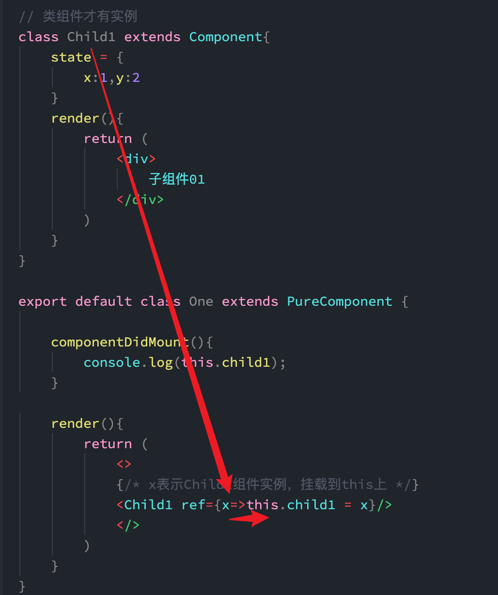
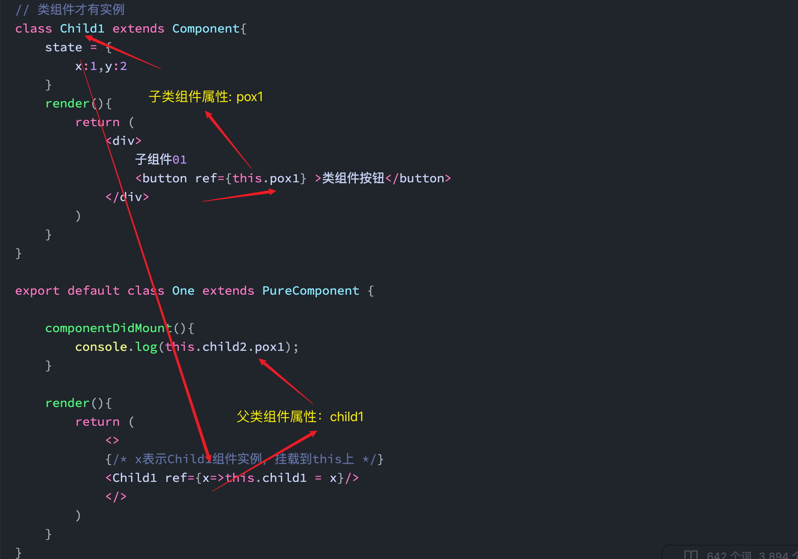
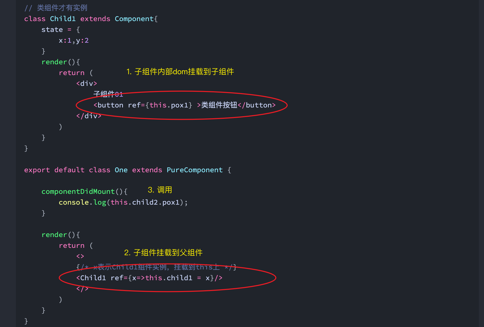
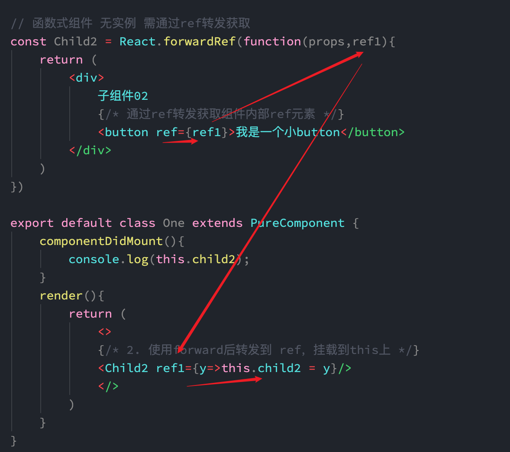

# ref 操作DOM


原始方法获取DOM
```TSX
import { Component, PureComponent, ReactNode } from "react";

// 如果继承了 Component，那么是可以实现添加span
// 如果继承了PureComponent，那么不可以添加

export default class One extends PureComponent {
    //虚拟DOM转化成真实DOM，并挂载完毕，此时，就可以获取DOM，操作DOM
    componentDidMount(): void {
        console.log(document.querySelector('h1'))
    }

    render(){
        return (
            <>
            <h1>温馨提示</h1>
            </>
        )
    }
}
```


ref 使用 标记名获取
```tsx
import { Component, PureComponent, ReactNode } from "react";


export default class One extends PureComponent {
    componentDidMount(): void {
        // ref 后面跟字符串，也废弃了
        console.log(this.refs.title)
    }

    render(){
        return (
            <>
            {/* ref 后面跟字符串 */}
            <h1 ref='title'>温馨提示</h1>
            </>
        )
    }
}
```

ref 使用传参函数获取
```js
import { PureComponent, ReactNode } from "react";


export default class One extends PureComponent {
    componentDidMount(){
        // ref 后面跟字符串，也废弃了
        console.log(this.box1)
    }

    render(){
        return (
            <>
            {/* ref后面跟了一个函数，形参x就表示dom元素，把这个dom元素绑定到this上面 */}
            {/* this表示组件实例，就是把dom元素挂载到了组件实例上 */}
            <h1 ref={x=>this.box1 = x} >温馨提示</h1>
            </>
        )
    }
}
```

使用 `React.createRef()`，box1是当前组件实例的属性
```TSX
import React, { Component, PureComponent, ReactNode } from "react";


export default class One extends PureComponent {
    // 1. box1是当前组件实例的属性
    box1 = React.createRef();

    componentDidMount(){
        console.log(this.box1.current)
    }

    render(){
        return (
            <>
            {/* 2.ref直接将DOM挂载到this.box1 */}
            <h1 ref={this.box1} >温馨提示</h1>
            </>
        )
    }
}
```

## ref 获取组件实例

> 类组件才有实例

### 获取整个实例
```JS
import React, { Component, PureComponent, ReactNode } from "react";
import Child from "./09-Son";

// 类组件才有实例
class Child1 extends Component{
    state = {
        x:1,y:2
    }
    render(){
        return (
            <div>
                子组件01
            </div>
        )
    }
}

export default class One extends PureComponent {
	
    componentDidMount(){
        console.log(this.child1);
    }

    render(){
        return (
            <>
            {/* x表示Child1组件实例，挂载到this上 */}
            <Child1 ref={x=>this.child1 = x}/>
            </>
        )
    }
}
```




### 获取实例中的DOM

```ts
import React, { Component, PureComponent, ReactNode } from "react";
import Child from "./09-Son";

// 类组件才有实例
class Child1 extends Component{
    state = {
        x:1,y:2
    }
    render(){
        return (
            <div>
                子组件01
                <button ref={this.pox1} >类组件按钮</button>
            </div>
        )
    }
}

export default class One extends PureComponent {

    componentDidMount(){
        console.log(this.child2.pox1);
    }

    render(){
        return (
            <>
            {/* x表示Child1组件实例，挂载到this上 */}
            <Child1 ref={x=>this.child1 = x}/>
            </>
        )
    }
}
```

ref挂载到子组件属性，父组件使用子组件标签内ref挂载子组件实例到父组件属性。父组件使用属性的属性调用

实际上就两步
1. 子组件内部DOM挂载到子组件属性
2. 子组件挂载到父组件属性



## ref 转发

> 获取函数式组件 内部DOM元素

### 获取函数式组件内部DOM

```JS
import React, { Component, PureComponent, ReactNode } from "react";
import Child from "./09-Son";


// 函数式组件 无实例 需通过ref转发获取
const Child2 = React.forwardRef(function(props,ref1){
    return (
        <div>
            子组件02
            {/* 通过ref转发获取组件内部ref元素 */}
            <button ref={ref1}>我是一个小button</button>
        </div>
    )
})

export default class One extends PureComponent {
    componentDidMount(){
	    // current获取当前函数返回的DOM
        console.log(this.child2.current);
    }
    render(){
        return (
            <>
            {/* 2. 使用forward后转发到 ref，挂载到this上 */}
            <Child2 ref1={y=>this.child2 = y}/>
            </>
        )
    }
}
```




