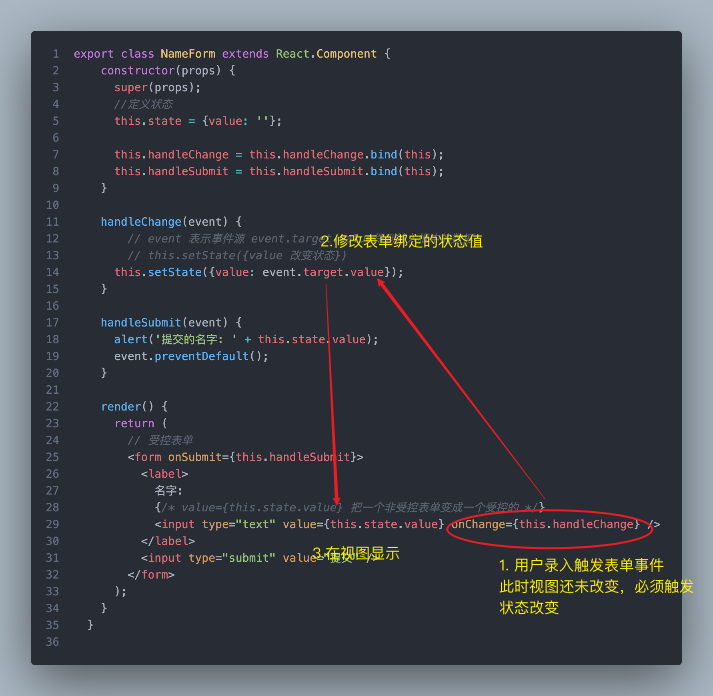
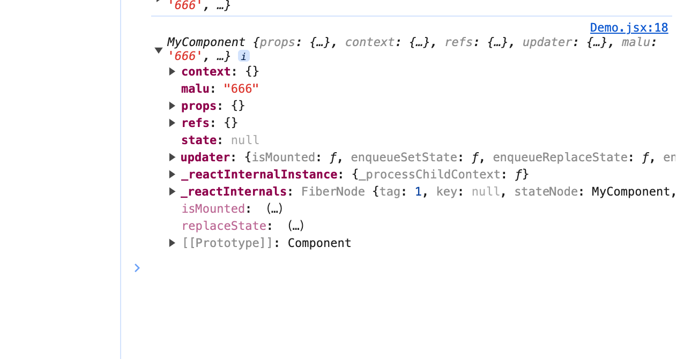
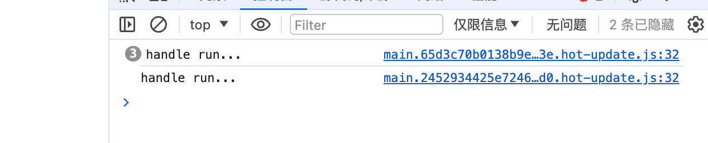

# 受控组件

### Input

```jsx
import React from "react";

export class NameForm extends React.Component {
    constructor(props) {
      super(props);
      //定义状态
      this.state = {value: ''};
  
      this.handleChange = this.handleChange.bind(this);
      this.handleSubmit = this.handleSubmit.bind(this);
    }
  
    handleChange(event) {
        // event 表示事件源 event.target.value得到输入框中的数据
        // this.setState({value 改变状态})
      this.setState({value: event.target.value});
    }
  
    handleSubmit(event) {
      alert('提交的名字: ' + this.state.value);
      //阻止默认事件
      event.preventDefault();
    }
  
    render() {
      return (
        // 受控表单  绑定表单提交submit事件
        <form onSubmit={this.handleSubmit}>
          <label>
            名字:
            {/* value={this.state.value} 把一个非受控表单变成一个受控的 */}
            <input type="text" value={this.state.value} onChange={this.handleChange} />
          </label>
          {/* 点击提交时，会触发表单的onSubmit事件 */}
          <input type="submit" value="提交" />
        </form>
      );
    }
  }
  
```




### textarea 

```tsx
<textarea>
  你好， 这是在 text area 里的文本
</textarea>
```

```tsx
class EssayForm extends React.Component {
  constructor(props) {
    super(props);
    this.state = {
      value: '请撰写一篇关于你喜欢的 DOM 元素的文章.'
    };

    this.handleChange = this.handleChange.bind(this);
    this.handleSubmit = this.handleSubmit.bind(this);
  }

  handleChange(event) {
    this.setState({value: event.target.value});
  }

  handleSubmit(event) {
    alert('提交的文章: ' + this.state.value);
    event.preventDefault();
  }

  render() {
    return (
      <form onSubmit={this.handleSubmit}>
        <label>
          文章:
          <textarea value={this.state.value} onChange={this.handleChange} />
        </label>
        <input type="submit" value="提交" />
      </form>
    );
  }
}
```


### select

```tsx
<select>
  <option value="grapefruit">葡萄柚</option>
  <option value="lime">酸橙</option>
  <option selected value="coconut">椰子</option>
  <option value="mango">芒果</option>
</select>
```

```tsx
class FlavorForm extends React.Component {
  constructor(props) {
    super(props);
    this.state = {value: 'coconut'};

    this.handleChange = this.handleChange.bind(this);
    this.handleSubmit = this.handleSubmit.bind(this);
  }

  handleChange(event) {
    this.setState({value: event.target.value});
  }

  handleSubmit(event) {
    alert('你喜欢的风味是: ' + this.state.value);
    event.preventDefault();
  }

  render() {
    return (
      <form onSubmit={this.handleSubmit}>
        <label>
          选择你喜欢的风味:
          <select value={this.state.value} onChange={this.handleChange}>
            <option value="grapefruit">葡萄柚</option>
            <option value="lime">酸橙</option>
            <option value="coconut">椰子</option>
            <option value="mango">芒果</option>
          </select>
        </label>
        <input type="submit" value="提交" />
      </form>
    );
  }
}
```


### 处理多个输入

```tsx
import React from "react";

export default class Reservation extends React.Component {
    constructor(props) {
      super(props);
      this.state = {
        isGoing: true,
        numberOfGuests: 2
      };
      
      this.handleInputChange = this.handleInputChange.bind(this);
    }
    // 推荐，多表单，对应一个方法
    handleInputChange(event) {
      const target = event.target;
      const value = target.type === 'checkbox' ? target.checked : target.value;
      const name = target.name;
  
      this.setState({
        // 修改状态 [name] []中的是一个变量
        [name]: value
      });
    }
  
    render() {
      return (
        <form>
          <label>
            参与:
            {/* input type='text' value+onChange */}
            {/* input type='checkbox' checkbox+onChange */}
            {/* input type='number' value+onChange */}
            <input
              name="isGoing"
              type="checkbox"
              checked={this.state.isGoing}
              onChange={this.handleInputChange} />
          </label>
          <br />
          <label>
            来宾人数:
            <input
              name="numberOfGuests"
              type="number"
              value={this.state.numberOfGuests}
              onChange={this.handleInputChange} />
          </label>
        </form>
      );
    }
  }
```

### 受控输入空值

在受控组件上指定 value 的 prop 会阻止用户更改输入。如果你指定了 value，但输入仍可编辑，则可能是你意外地将 value 设置为 undefined 或 null。

下面的代码演示了这一点。（输入最初被锁定，但在短时间延迟后变为可编辑。）

```JSX
ReactDOM.createRoot(mountNode).render(<input value="hi" />);

setTimeout(function() {
  ReactDOM.createRoot(mountNode).render(<input value={null} />);
}, 1000);
```


### 事件绑定

在React中，当我们在类组件的方法中处理事件时，`this` 的值可能会变得不是我们预期的。这主要是因为JavaScript中函数的作用域和`this`的绑定方式。

在React的类组件中，如果你直接在JSX中使用一个方法作为事件处理器（如`onClick`），那么默认情况下，这个事件处理器在调用时其`this`不会指向类组件的实例。这是因为React在调用事件处理器时不会为你自动绑定`this`。

例如：


```jsx
class MyComponent extends React.Component {
  handleClick() {
    console.log(this); // 这里可能会是undefined，或者不是MyComponent的实例
  }

  render() {
    return <button onClick={this.handleClick}>Click me</button>;
  }
}
```

为了解决这个问题，React社区提供了几种常见的解决方案：

1. **在构造函数中绑定`this`**：

```jsx
class MyComponent extends React.Component {
  constructor(props) {
    super(props);
    this.handleClick = this.handleClick.bind(this);
  }

  handleClick() {
    console.log(this); // 这里是MyComponent的实例
  }

  // ...
}
```

2. **使用箭头函数**：箭头函数不会创建自己的`this`上下文，所以你可以直接在JSX中使用箭头函数来确保`this`指向类组件的实例。但是，请注意，这种方法在每次渲染时都会创建一个新的函数，这可能会影响性能（尤其是在大型应用或频繁渲染的组件中）。

```jsx
class MyComponent extends React.Component {
  handleClick = () => {
    console.log(this); // 这里是MyComponent的实例
  }

  render() {
    return <button onClick={this.handleClick}>Click me</button>;
  }
}
```

3. **使用类属性语法（需要Babel转换）**：如上面的箭头函数示例所示，但这不需要在构造函数中显式绑定。

4. **使用第三方库，如`class-properties`或`autobind-decorator`**：这些库提供了装饰器或其他语法糖来自动绑定`this`。但是，它们可能增加了额外的复杂性，并且不是React核心团队推荐的解决方案。

#### 方法1

```JS
<button onClick={this.handle.bind(this)}>点我</button>
```

```JSX
import React from "react";

export default class Reservation extends React.Component {
  constructor(props){
    super(props);
  }
  
  handle(){
    alert('点我干啥？')
  }
  render(){
    return(
      <>
        {/* bind可以改变this指向，可以指向方法中的this指向bind中的第一个参数 */}
        {/* bind(this) this表示组件实例 就是让handle方法中的this 指向组件实例 */}
        {/* this.handle.bind(this) 返回绑定this了的handle函数。然后执行， */}
        {/* bind表示 this.handle 这个方法中的this 绑定 到组件实例this */}
        <button onClick={this.handle.bind(this)}>点我</button>
      </>
    )
  }
}
```

#### 方法2

```JS
    this.handle = this.handle.bind(this);
```

```JS
import React from "react";

export default class Reservation extends React.Component {
  constructor(props){
    super(props);
    // 让handle中的this指向bind第一个参数（组件实例）
    // bind返回改变了this指向的新函数
    this.handle = this.handle.bind(this);
    this.malu = "666"
  }
  
  handle(){
    alert('点我干啥？')
  }
  render(){
    return(
      <>
        
        <button onClick={this.handle}>点我</button>
      </>
    )
  }
}
```


#### 关于react this.handleClick = this.handleClick.bind(this)；

##### 关于onClick中的this

```ts
import React from "react";

export default class MyComponent extends React.Component {
  constructor(props){
    super(props);
    this.malu = "666"
  }
  
  handle(){
    alert('点我干啥？')
  }
  render(){
    return(
      <>
      //组件初始化会直接打印
        <button onClick={console.log(this)}>点我</button>
      </>
    )
  }
}
```


可以看到，onClick中的this是组件实例

##### 如何传递给onClick方法

在render方法中，想传递给onClick 类方法只能通过`this.xxx`的形式
`xxx` 会作为一个方法参数（函数对象）传递。即函数是一个独立的对象，函数相当于一个全局对象
onClick中，在严格模式下(use strict)，未绑定的全局函数调用中的this会是undefined。
传递给onClick中后会在组件实例中直接作为回调调用，方法的this会变成undefined
解决：绑定`xxx`函数 的 this

```TS
// 类的 contructor中
this.sum = this.sum.bind(this); // sum中this显式绑定
```
`sum`函数 的this绑定到 类实例，返回一个绑定好的函数。


不使用函数的this时正常
```TSX
export default class MyComponent extends React.Component {
  constructor(props){
    super(props);
    this.malu = "666"
  }
  
  handle(){
    console.log("handle run...")
  }
  render(){
    return(
      <>
        <button onClick={this.handle}>点我</button>
      </>
    )
  }
}
```



#### 方法3

直接传箭头函数，不会丢失上下文this

```TS
<button onClick={()=>{this.handle}}>点我</button>
```


